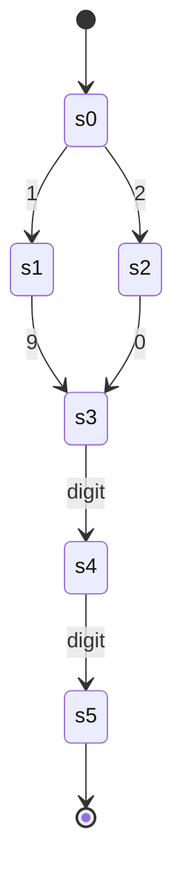
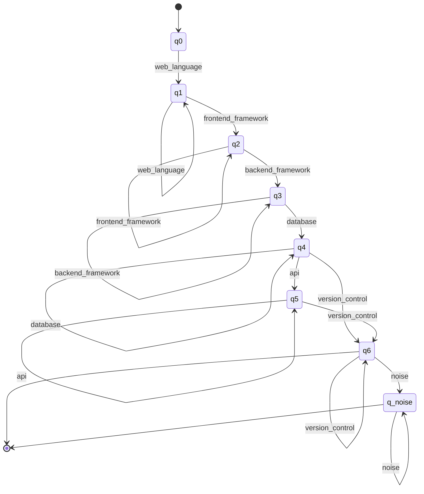
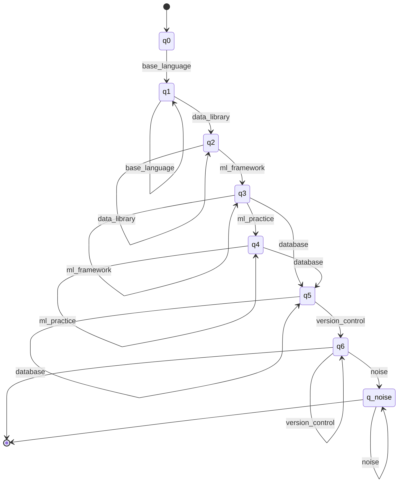
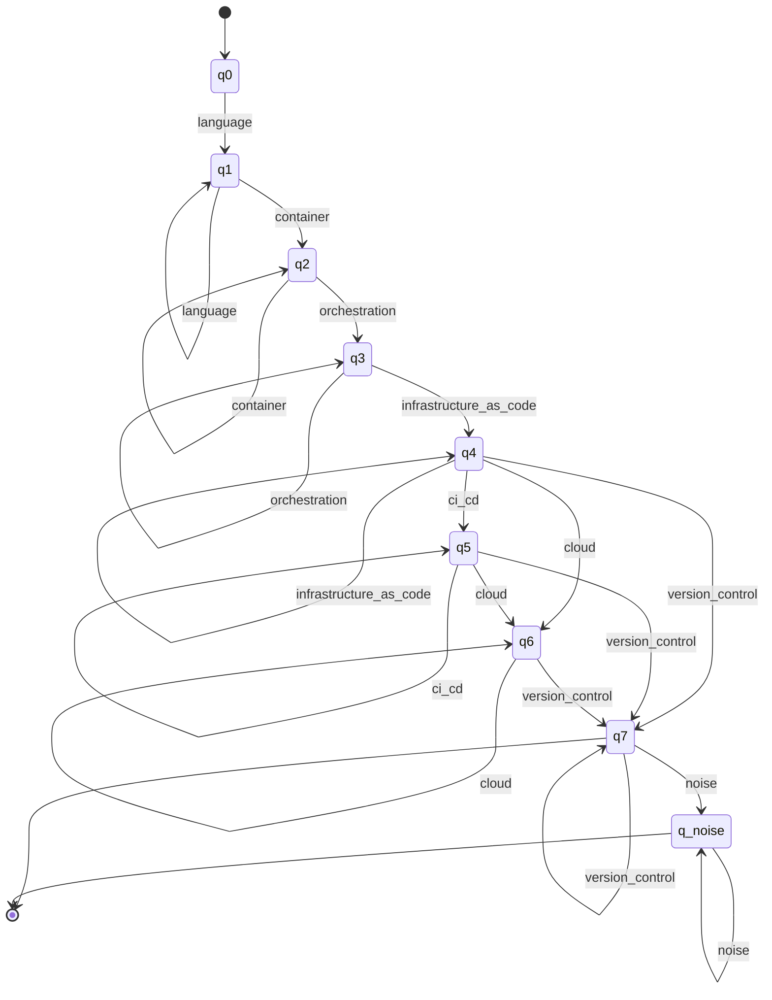
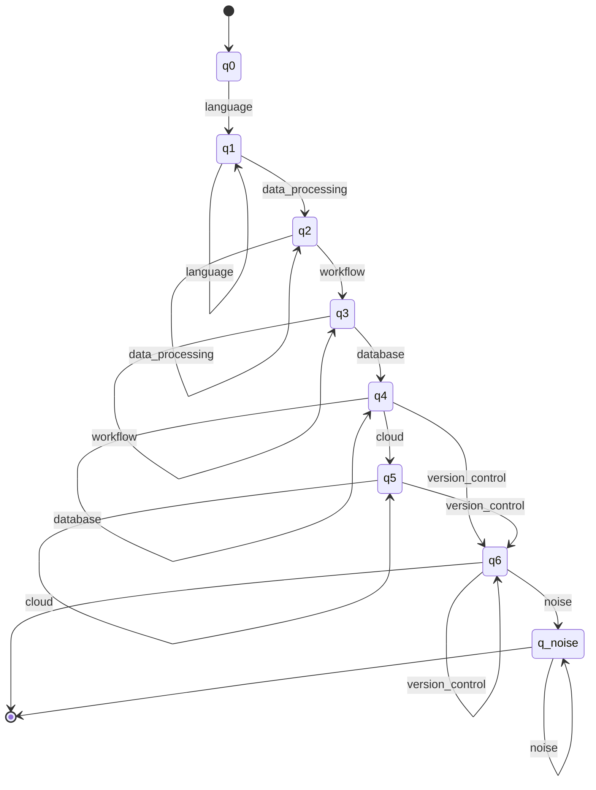

# ResumeLens — Formalization

Theoretical specification of the four formal models used by ResumeLens (deliverable:
*formal definitions of the models and their relation to the implementation*). Each section
states the mathematical object first and then maps it to the code that implements it.

| Section | Stage | Formal model | Status |
|---|---|---|---|
| 1 | Extraction | Regular expressions (regular languages) | included |
| 2 | Normalization | Finite-state transducers (7-tuples) | included |
| 3 | Classification | Finite automata (5-tuples) | included |
| 4 | Candidate profile language | Context-free grammar (EBNF, textX) | included |

This document combines the detailed formal specification of Stage 1, the normalization
model of Stage 2, the profile automata of Stage 3 and the context-free grammar of the
candidate profile language of Stage 4.

---

## Section 1. Stage 1 — Regular Expressions and Lexical Extraction

Source of truth: `resumelens/extraction/patterns.py` (22 patterns in the registry
`PATTERNS`, plus the skill registry `SKILL_PATTERNS` and the delimiter
`SKILL_SEPARATOR_PATTERN`). Their orchestration lives in `resumelens/extraction/extractor.py`
(Section 1.8) and is not part of the formal model.

### 1.1 Conventions

- A *pattern* is a Python `re` expression written with the constructs of formal language
  theory (concatenation, alternation, Kleene star and its derived forms) plus a small set of
  zero-width assertions (Section 1.5).
- $`L(r)`$ denotes the language of strings generated by the expression $`r`$. Inside a regular
  expression, $`r \mid s`$ is alternation; between languages, $`A \cup B`$ is union.
- Derived operators are syntactic sugar over the three primitive operations:

```math
r^{+} = r\,r^{*}, \qquad r^{?} = r \mid \varepsilon, \qquad r^{\{m,n\}} = \bigcup_{k=m}^{n} r^{k}, \qquad r^{\{m,\}} = r^{m}\,r^{*}
```

- A character class such as `[A-Za-z]` is the finite union of its symbols.
- Two things are needed for every pattern: an *inclusion language* $`L(r)`$ ("which strings
  have the right shape") and a *match semantics* ("which substring is reported"). Section 1.4
  defines the former; Section 1.6.2 explains the latter.
- In formulas, $`\mathtt{x}`$ is the literal symbol `x`, juxtaposition is concatenation, and
  $`\mathsf{NAME}`$ is a named language that is defined next to its first use.

### 1.2 Input alphabet $`\Sigma`$ and character classes

Resumes are read by `core.reader.read_resume_file`, which decodes UTF-8, deletes the NUL
character and rewrites `\r\n` and `\r` as `\n`. The alphabet seen by Stage 1 is therefore

```math
\Sigma = \{\, c \in \text{Unicode scalar values} \;:\; c \neq \mathtt{U{+}0000},\ c \neq \mathtt{U{+}000D} \,\}
```

$`\Sigma`$ is a **finite** set (fewer than $`2^{20}+2^{16}`$ symbols), so every classical result on
regular languages over finite alphabets applies. The text is a word $`w \in \Sigma^{*}`$ in
which `\n` is the only line terminator.

The patterns use the following character classes (all are finite subsets of $`\Sigma`$):

| Symbol | Python | Set |
|---|---|---|
| $`\mathrm{Dg}`$ | `\d` | Unicode decimal digits (includes `0`–`9`) |
| $`\mathrm{Dg}_{\mathrm{asc}}`$ | `[0-9]` | ASCII digits, $`\mathrm{Dg}_{\mathrm{asc}} \subset \mathrm{Dg}`$ |
| $`\mathrm{Wd}`$ | `\w` | Unicode letters, digits and `_` |
| $`\mathrm{Al}`$ | `[A-Za-z]` | ASCII letters only |
| $`\mathrm{Al}_{\mathrm{num}}`$ | `[A-Za-z0-9]` | ASCII letters and digits |
| $`\mathrm{Lt}`$ | `[^\W\d_]` | Unicode letters of any alphabet |
| $`S_h`$ | `[ \t]` | horizontal whitespace: space and tab |
| $`S`$ | `[ .-]` | phone separators: space, dot, hyphen |

Note the asymmetry: `\d`, `\w` and `[^\W\d_]` are Unicode-aware (the `re.ASCII` flag is not
set), while explicit classes such as `[A-Za-z]` are ASCII-only. The name pattern uses the
Unicode-aware class $`\mathrm{Lt}`$, so accented names are recognized (`José Núñez`); the
ASCII-only classes remain in the email, the top-level domain and the job role.

Pattern-specific classes, named once here and used in Section 1.4:

| Symbol | Python | Used by |
|---|---|---|
| $`U`$ | `[A-Za-z0-9._%+-]` | user part of the email |
| $`L_d`$ | `[A-Za-z0-9-]` | labels of a host name |
| $`G`$ | `[\w%~+-]` | segments of a URL path |
| $`G_{\mathrm{li}}`$ | `[\w%-]` | LinkedIn handle |
| $`G_{\mathrm{gh}}`$ | `[\w-]` | GitHub user and repository |
| $`\mathrm{Dash}`$ | `[-–—]` | hyphen, en dash, em dash (separator of a period) |
| $`\mathrm{Cp}`$ | `[A-Z][\w&'-]*` | capitalized word of an institution |
| $`\mathrm{Cp}_{\mathrm{n}}`$ | `[A-ZÁÉÍÓÚÑÜ]` | first letter of a name word |
| $`\mathrm{Nc}`$ | `['’.-]` | apostrophes, dots and hyphens inside a name word |

### 1.3 Reusable lexical fragments

Fragments are plain strings composed by the compiled patterns.

```math
\begin{aligned}
\mathsf{YEAR} &= (19 \mid 20)\,\mathrm{Dg}\,\mathrm{Dg} && \text{over ASCII digits: } L = \{1900,\dots,2099\},\ |L| = 200
\\ \mathsf{MONTH} &= \{\text{Jan}, \text{January}, \dots, \text{Sep}, \text{Sept}, \text{September}, \dots, \text{Dec}, \text{December}\} && \text{English names and abbreviations}
\\ \mathsf{DATE} &= \big(\mathsf{MONTH}\ \mathtt{.}^{?}\ S_h^{+}\big)^{?}\ \mathsf{YEAR} && \text{e.g. } 2023,\ \text{Mar 2023}
\\ \mathsf{OPEN} &= \{\text{Present}, \text{Current}, \text{Now}, \text{Ongoing}\} && \text{open-ended period}
\\ \mathsf{SEP} &= S_h^{*}\,\big(\mathrm{Dash} \mid \mathtt{to}\big)\,S_h^{*} && \text{dash, or the word } to
\\ \mathsf{RANGE} &= \mathsf{DATE}\ \mathsf{SEP}\ (\mathsf{DATE} \mid \mathsf{OPEN}) && \text{e.g. } 2019 - 2023,\ \text{Jan 2020 to Present}
\end{aligned}
```

Two remarks on the formulas:

- `\d` is Unicode-aware, so `YEAR` also accepts `19` followed by any two Unicode digits
  (for instance Arabic-Indic digits). Restricted to ASCII digits it is exactly the 200 years
  1900–2099; resumes are ASCII in this field, so the difference is immaterial.
- `to` is guarded by word boundaries (`\bto\b`, Section 1.5.1), so the word is only
  recognized between non-word symbols: `2019 to 2023` is in $`L(\mathsf{RANGE})`$ but
  `2019to2023` is not.

`YEAR` is a finite language, so it is regular. Its minimal DFA (over ASCII digits) has six
states plus an implicit dead state:



Every transition not drawn leads to the (non-accepting) dead state. The automaton was
checked against `re.fullmatch(r"(?:19|20)[0-9]{2}", w)` over all words of length 0–5 on the
alphabet `{0, 1, 2, 9, a}`, with no disagreement.

### 1.4 Languages recognized by each pattern

Every pattern is a regular expression, hence $`L(\text{pattern})`$ is a regular language.
Languages with a finite number of strings are marked *finite*.

| Registry key | Pattern | Flags | Language |
|---|---|---|---|
| `email` | `EMAIL_PATTERN` | none | infinite |
| `phone` | `PHONE_PATTERN` | none | infinite |
| `url` | `URL_PATTERN` | IGNORECASE | infinite |
| `linkedin` | `LINKEDIN_URL_PATTERN` | IGNORECASE | infinite |
| `github` | `GITHUB_URL_PATTERN` | IGNORECASE | infinite |
| `section_header` | `SECTION_HEADER_PATTERN` | MULTILINE, IGNORECASE | finite core, anchored per line |
| `name` | `NAME_PATTERN` | none | infinite, anchored |
| `date_range` | `DATE_RANGE_PATTERN` | IGNORECASE | infinite |
| `degree` | `DEGREE_PATTERN` | none | infinite |
| `institution` | `INSTITUTION_PATTERN` | none | infinite |
| `education_entry` | `EDUCATION_ENTRY_PATTERN` | MULTILINE, IGNORECASE | infinite (spans two lines) |
| `programming_language` | `PROGRAMMING_LANGUAGE_PATTERN` | IGNORECASE, with a case-sensitive group | finite |
| `framework` | `FRAMEWORK_PATTERN` | IGNORECASE | finite |
| `ml_library` | `ML_LIBRARY_PATTERN` | IGNORECASE | finite |
| `ml_practice` | `ML_PRACTICE_PATTERN` | IGNORECASE | finite |
| `database` | `DATABASE_PATTERN` | IGNORECASE | finite |
| `data_tool` | `DATA_TOOL_PATTERN` | IGNORECASE | finite |
| `api` | `API_PATTERN` | none (case-sensitive) | finite |
| `version_control` | `VERSION_CONTROL_PATTERN` | IGNORECASE | finite |
| `devops_cloud` | `DEVOPS_CLOUD_PATTERN` | IGNORECASE | finite |
| `years_experience` | `YEARS_EXPERIENCE_PATTERN` | IGNORECASE | infinite |
| `experience_entry` | `EXPERIENCE_ENTRY_PATTERN` | MULTILINE, IGNORECASE | infinite |

`SKILL_PATTERNS` is the registry of the nine skill patterns, in the order the extractor
reports them. `SKILL_SEPARATOR_PATTERN` is a delimiter used to split a list, not an extraction
pattern, so it is not in `PATTERNS` (Section 1.4.5).

**Case-insensitive flag.** With `re.IGNORECASE`, the language of an expression $`r`$ is
$`L_{i}(r) = L(r')`$ where $`r'`$ replaces every literal letter $`a`$ by the class
$`(a \mid A)`$ (and, for Unicode, by its case-folding orbit). The result is again regular,
so the flag does not leave the class of regular languages.

#### 1.4.1 Contact

**Email.** With $`U`$ and $`L_d`$ from Section 1.2,

```math
L(\mathsf{EMAIL}) = U^{+}\ \mathtt{@}\ L_{d}^{+}\,\big(\mathtt{.}\,L_{d}^{+}\big)^{*}\,\mathtt{.}\,\mathrm{Al}^{\{2,\}}
```

The domain therefore has at least one dot and a top-level label of two or more letters;
the pattern is delimited by `\b` on both ends. Named groups: `user`, `domain`.
Accepted: `wednesday.addams@nevermore.edu`. Rejected: `user@localhost` (no dot),
`a@b.c` (one-letter top-level domain), `juan.perez at mail` (no `@`).

**Phone.** With $`S`$ from Section 1.2,

```math
L(\mathsf{PHONE}) = \big(\mathtt{+}\,\mathrm{Dg}^{\{1,3\}}\,S^{?}\big)^{?}\ \big(\mathtt{(}\big)^{?}\,\mathrm{Dg}^{3}\,\big(\mathtt{)}\big)^{?}\,S^{?}\ \mathrm{Dg}^{3}\,S^{?}\ \mathrm{Dg}^{4}
```

Named groups: `country`, `area`, `prefix`, `line`. The shape is $`3\text{-}3\text{-}4`$ digits
with an optional country prefix. Accepted: `+1 555 666 7777`, `(555) 123-4567`,
`5551234567`. Rejected: `2019 - 2023` (the first group of digits has length four, so no
$`3\text{-}3\text{-}4`$ factorization exists) and `5551234`.

Remark: the two parentheses are *independently* optional, so `(555 123 4567` also belongs
to the language. Enforcing that parentheses come in pairs is possible here only because
the nesting depth is bounded by one; unbounded balanced parentheses (the Dyck language)
would **not** be regular. The implemented language is a deliberate superset.

**URL.** With $`G`$ from Section 1.2, $`\mathsf{seg} = G^{+}`$ and
$`\mathsf{host} = L_{d}^{+}(\mathtt{.}\,L_{d}^{+})^{+}`$,

```math
L(\mathsf{URL}) = (\mathtt{http} \mid \mathtt{https})\ \mathtt{://}\ \mathsf{host}\ \big(\mathtt{/}\ \mathsf{seg}\,(\mathtt{.}\,\mathsf{seg})^{*}\big)^{*}
```

Named groups: `scheme`, `host`, `path`. A dot is only allowed *between* two segments, so a
sentence-ending period is never part of the match (`https://github.com/user.` reports
`https://github.com/user`). Rejected: `ftp://x.com`, `http://localhost` (the host needs a dot).

**LinkedIn and GitHub.** With $`G_{\mathrm{li}}`$ and $`G_{\mathrm{gh}}`$ from Section 1.2,

```math
\begin{aligned}
L(\mathsf{LINKEDIN}) &= \mathtt{http}\,\mathtt{s}^{?}\ \mathtt{://}\ (\mathtt{www.})^{?}\,\mathtt{linkedin.com}\ \mathtt{/}\ (\mathtt{in} \mid \mathtt{company})\ \mathtt{/}\ G_{\mathrm{li}}^{+}
\\ L(\mathsf{GITHUB}) &= \mathtt{http}\,\mathtt{s}^{?}\ \mathtt{://}\ (\mathtt{www.})^{?}\,\mathtt{github.com}\ \mathtt{/}\ G_{\mathrm{gh}}^{+}\ \big(\mathtt{/}\ G_{\mathrm{gh}}^{+}(\mathtt{.}\,G_{\mathrm{gh}}^{+})^{*}\big)^{?}
\end{aligned}
```

Both are specializations of the generic URL language: every handle, user or repository
segment is also a `seg`, and the fixed hosts have a dot, so
$`L(\mathsf{LINKEDIN}) \subseteq L(\mathsf{URL})`$ and $`L(\mathsf{GITHUB}) \subseteq L(\mathsf{URL})`$
(the three patterns are case-insensitive). The inclusion is what lets the extractor use the
generic pattern to collect every link and the specialized ones to identify the LinkedIn and
GitHub profiles among them. Accepted: `https://www.linkedin.com/in/gwen-stacy`,
`https://github.com/mjwatson`. Rejected: `https://linkedin.com/feed`, `https://gitlab.com/x`.

#### 1.4.2 Structure, name and education

**Section header.** Let $`T`$ be the finite set of titles
$`\{\text{Contact}, \text{Summary}, \text{Technical Skills}, \text{Skills}, \text{Education}, \text{Experience}, \text{Work Experience}, \text{Projects}, \text{Certifications}\}`$.
Per line,

```math
L(\mathsf{SECTION\_HEADER}) = S_h^{*}\ T\ S_h^{*}\ \mathtt{:}\ S_h^{*}
```

with the anchors of Section 1.5.4 forcing the whole line to be of that shape. Named group:
`title`. Accepted: `Technical Skills:`. Rejected: `Technical Skills: Python` (text after
the colon) and `Technical  Skills:` (two spaces: the space inside a title is a literal
symbol, not a class).

**Name.** With $`\mathrm{Cp}_{\mathrm{n}}`$ and $`\mathrm{Lt}`$ from Section 1.2,
$`\mathsf{WORD} = \mathrm{Cp}_{\mathrm{n}}\,\big(\mathrm{Lt} \mid \mathrm{Nc}\big)^{*}`$ and

```math
L(\mathsf{NAME}) = \mathsf{WORD}\ \big(S_h^{+}\,\mathsf{WORD}\big)^{\{1,3\}}
```

that is, two to four words, each starting with an upper-case letter. Named group: `name`.
The pattern is anchored with `^…$` and is applied to the first non-empty line of the text.
Accepted: `Mary Jane Watson`, `WEDNESDAY ADDAMS`, `José Núñez`. Rejected: `juan perez`
(lower case), `Ana` (one word), `Contact:`.

**Date range.** $`L(\mathsf{DATE\_RANGE}) = L(\mathsf{RANGE})`$ with a word boundary on both
ends. Named groups: `start`, `end`. Accepted: `2019 - 2023`, `Jan 2020 to Present`,
`March 2021 – 2022`.

**Degree.** Let $`\mathsf{LEVEL}`$ be the finite set
$`\{\text{Bachelor}, \text{Master}, \text{Associate}, \text{Doctorate}, \text{PhD}, \text{Ph.D}, \text{MBA}, \text{BSc}, \text{MSc}, \text{BS}, \text{B.S}, \text{MS}, \text{M.S}, \text{BA}, \text{B.A}, \text{MA}, \text{M.A}, \text{BEng}, \text{B.Eng}, \text{MEng}, \text{M.Eng}\}`$
(without a trailing period), and let
$`\mathsf{FIELD} = (\Sigma \setminus \{\mathtt{\backslash n}, \mathtt{,}, \mathtt{;}, \mathtt{(}\})^{*}\,(\Sigma \setminus (\{\mathtt{,}, \mathtt{;}, \mathtt{(}\} \cup \text{whitespace}))`$,
that is, a non-empty string without line breaks, commas, semicolons or `(`, whose last
symbol is not whitespace. Then

```math
L(\mathsf{DEGREE}) = \mathsf{LEVEL}\ \mathtt{.}^{?}\ \big(S_h^{+}\,\mathtt{of}\,S_h^{+}\,\mathrm{Al}^{+}\big)^{?}\ S_h^{+}\ (\mathtt{in} \mid \mathtt{of})\ S_h^{+}\ \mathsf{FIELD}
```

Named groups: `degree`, `level`, `field`. This pattern is **case-sensitive** (no
`IGNORECASE`). Accepted: `B.S. in Computer Science`, `Master of Science in Data Science`.
Rejected: `B.S.. in X` (a single optional period).

**Institution.** With $`\mathrm{Cp}`$ from Section 1.2 and
$`K = \{\text{University}, \text{Institute}, \text{College}, \text{School}, \text{Academy}, \text{Polytechnic}, \text{Tech}\}`$,

```math
\begin{aligned}
L(\mathsf{INSTITUTION}) ={}& \mathtt{University}\,S_h^{+}\,\mathtt{of}\,S_h^{+}\,\mathrm{Cp}\,(S_h^{+}\,\mathrm{Cp})^{*}
\\ \cup\ & \mathtt{Universidad}\,S_h^{+}\,\big(\mathtt{de}\,S_h^{+}\,(\mathtt{la}\,S_h^{+})^{?}\big)^{?}\,\mathrm{Cp}
\\ \cup\ & (\mathrm{Cp}\,S_h^{+})^{*}\ K
\end{aligned}
```

Named group: `institution`. Case-sensitive. Accepted: `Nevermore University`,
`University of Michigan`, `Universidad de la Sabana`.

**Education entry** (two lines). With $`\mathsf{INST}' = (\Sigma \setminus \{\mathtt{\backslash n}, \mathtt{(}\})^{+}`$,

```math
L(\mathsf{EDUCATION\_ENTRY}) = S_h^{*}\ \mathsf{DEGREE}\ S_h^{*}\ \mathtt{\backslash n}\ S_h^{*}\ \mathsf{INST}'\ S_h^{*}\ \mathtt{(}\ \big(\mathsf{RANGE} \mid \mathsf{YEAR}\big)\ \mathtt{)}
```

Named groups: `degree`, `level`, `field`, `institution`, `start`, `end`, `graduation`.
It contains exactly one `\n`, so it is a regular language over several lines; relating the
two lines of a record does not need a context-free model. Accepted:
`B.S. in Computer Science` followed by `Nevermore University (2019 - 2023)`.

#### 1.4.3 Technical skills (finite languages)

The nine skill patterns recognize **finite** sets of tokens, so they are the simplest
regular languages: finite unions of words. All of them name their group `skill`.

```math
\begin{aligned}
L_{\mathrm{lang}} &= L_{\mathrm{ci}} \cup L_{\mathrm{cs}}
\\ L_{\mathrm{ci}} &= \{\text{Python}, \text{JavaScript}, \text{JS}, \text{TypeScript}, \text{TS}, \text{Java}, \text{Golang}, \text{Rust}, \text{Kotlin}, \text{Swift}, \text{PHP}, \text{Ruby}\}
\\ L_{\mathrm{cs}} &= \{\text{Go}, \text{C++}, \text{C\#}, \text{C}\}
\\ L_{\mathrm{fw}} &= \{\text{React}, \text{React.js}, \text{ReactJS}, \text{Angular}, \text{Angular.js}, \text{Vue}, \text{Vue.js}, \text{Node}, \text{Node.js}, \text{NodeJS}, \text{Django}, \text{Spring Boot}, \text{Express}, \text{Express.js}, \text{Next}, \text{Next.js}, \text{NextJS}, \text{Flask}, \text{FastAPI}, \text{Laravel}\}
\\ L_{\mathrm{ml}} &= \{\text{Pandas}, \text{NumPy}, \text{Scikit-learn}, \text{Scikit learn}, \text{sklearn}, \text{Keras}, \text{Matplotlib}, \text{TensorFlow}, \text{Tensor Flow}, \text{PyTorch}, \text{Py Torch}\}
\\ L_{\mathrm{prac}} &= \big(\mathsf{ML} \mid \mathsf{ML}\ S_h^{+}\mathtt{model}\,S_h^{+}\mathtt{development}\big),\ \mathsf{ML} \in \{\text{Machine-learning}, \text{Machine learning}\},\ \text{or } \text{ML model development}
\\ L_{\mathrm{db}} &= \{\text{PostgreSQL}, \text{Postgres}, \text{MySQL}, \text{MariaDB}, \text{Oracle}, \text{SQLite}, \text{SQL Server}, \text{MongoDB}, \text{Mongo}, \text{Redis}, \text{Cassandra}, \text{NoSQL}, \text{SQL}\}
\\ L_{\mathrm{data}} &= \{\text{Spark}, \text{Apache Spark}, \text{PySpark}, \text{Airflow}, \text{Apache Airflow}\}
\\ L_{\mathrm{api}} &= \{\text{REST}, \text{RESTful}\}\ \big(S_h^{+}\{\text{API}, \text{APIs}\}\big)^{?}
\\ L_{\mathrm{vcs}} &= \{\text{Git}, \text{GitHub}, \text{GitLab}, \text{Bitbucket}\}
\\ L_{\mathrm{cloud}} &= \{\text{Docker}, \text{Kubernetes}, \text{Terraform}, \text{Jenkins}, \text{Ansible}, \text{AWS}, \text{Amazon Web Services}, \text{Azure}, \text{Microsoft Azure}, \text{GCP}, \text{Google Cloud}, \text{Google Cloud Platform}\}
\end{aligned}
```

| Registry key | Language | Case |
|---|---|---|
| `programming_language` | $`L_{\mathrm{lang}}`$ | $`L_{\mathrm{ci}}`$ ignores case; $`L_{\mathrm{cs}}`$ (`Go`, `C++`, `C#`, `C`) is case-sensitive |
| `framework` | $`L_{\mathrm{fw}}`$ | ignores case |
| `ml_library` | $`L_{\mathrm{ml}}`$ | ignores case |
| `ml_practice` | $`L_{\mathrm{prac}}`$, rejected when followed by $`S_h^{+}\,\text{Engineer}`$ | ignores case |
| `database` | $`L_{\mathrm{db}}`$ | ignores case |
| `data_tool` | $`L_{\mathrm{data}}`$ | ignores case |
| `api` | $`L_{\mathrm{api}}`$ | case-sensitive |
| `version_control` | $`L_{\mathrm{vcs}}`$ | ignores case |
| `devops_cloud` | $`L_{\mathrm{cloud}}`$ | ignores case |

Where a spelling has a space (`Spring Boot`, `SQL Server`, `Tensor Flow`, `Apache Spark`, the
words of $`L_{\mathrm{prac}}`$ and $`L_{\mathrm{api}}`$) the space is the class $`S_h^{+}`$, so any run of
spaces or tabs is accepted; the exceptions are `Scikit[- ]learn` and `Machine[- ]learning`,
which take exactly one space or hyphen. The case-sensitive group exists because `go` and
`rest` are ordinary English words and a lone `c` is a letter: with $`L_{\mathrm{cs}}`$ and
$`L_{\mathrm{api}}`$ case-sensitive, `go to the store` and `the rest of the day` report nothing,
while `Go`, `C` and `REST APIs` are recognized.

The set of recognized skills is the union of the nine languages. Regular languages are
closed under union, so it is regular as well. The patterns do not decide whether two
spellings are equivalent (`JS` and `JavaScript` are reported separately): equivalence is the
task of the transducers of Stage 2.

#### 1.4.4 Experience

**Declared years.**

```math
L(\mathsf{YEARS}) = \mathrm{Dg}^{\{1,2\}}\,\mathtt{+}^{?}\ S_h^{+}\ \mathtt{year}\,\mathtt{s}^{?}\ S_h^{+}\,\mathtt{of}\,S_h^{+}\ \big(\mathtt{professional}\,S_h^{+}\big)^{?}\ \mathtt{experience}\ \Big(S_h^{+}\,(\Sigma \setminus \{\mathtt{\backslash n}, \mathtt{.}\})^{+}\Big)^{?}
```

Named groups: `years`, `plus`, `activity`. Accepted:
`3 years of experience developing web applications` (group `activity` =
`developing web applications`; the final period is excluded because `.` is not allowed
inside the activity).

**Job entry.** With
$`\mathsf{ROLE} = \mathrm{Al}\,(\Sigma \setminus \{\mathtt{\backslash n}, \mathtt{,}, \mathtt{(}, \mathtt{)}, \mathtt{@}, \mathtt{|}\})^{*}`$ and
$`\mathsf{COMPANY} = (\Sigma \setminus \{\mathtt{\backslash n}, \mathtt{(}, \mathtt{)}\})^{+}`$,

```math
L(\mathsf{EXPERIENCE\_ENTRY}) = S_h^{*}\ \mathsf{ROLE}\ S_h^{*}\ (\mathtt{,} \mid \mathtt{at} \mid \mathtt{@} \mid \mathtt{|})\ S_h^{*}\ \mathsf{COMPANY}\ S_h^{*}\ \mathtt{(}\,\mathsf{RANGE}\,\mathtt{)}
```

Named groups: `role`, `company`, `start`, `end`. The role must start with a letter, so a
bullet line such as `- Built a dashboard, Acme (2020 - 2021)` is not in the language.
Accepted: `Full Stack Developer, Raven Labs (2023 - 2026)`.

#### 1.4.5 Skill list

The skills that go to Stage 2 are not found by the bank but cut from the *Technical Skills*
section. With $`\mathsf{SEPS} = \{\mathtt{,}, \mathtt{;}, \mathtt{\backslash n}\}`$ (the language of
`SKILL_SEPARATOR_PATTERN`), the section body is split on $`\mathsf{SEPS}`$ and each piece is
stripped of surrounding whitespace and of a trailing period; empty pieces are dropped:

```math
\mathsf{RAW\_SKILL} = \big(\Sigma \setminus \mathsf{SEPS}\big)^{+} \quad \text{(after stripping)}
```

For the section `JS, React.js, NodeJS, Postgres, Git.` this gives exactly the five strings
of the assignment: `JS`, `React.js`, `NodeJS`, `Postgres`, `Git`, in order of appearance and
not normalized. The result is stored in `RawResumeData.raw_skills`. The skills found by the
bank over the whole resume go to `RawResumeData.detected_skills`, grouped by type; they are
informational and are not the input of Stage 2.

### 1.5 Lexical delimiters: formal justification

The patterns use four families of delimiters. This subsection shows that each one is
needed and that none of them takes the system out of the class of regular languages.

| Delimiter | Meaning | What it is used for |
|---|---|---|
| `\b` | Boundary between a symbol of $`\mathrm{Wd}`$ and one that is not | `Reactive` does not produce `React`, `githubprofile` does not produce `Git`; the `SQL` of `MySQL` is not reported on its own |
| `(?<![\w.])` | The previous symbol is neither in $`\mathrm{Wd}`$ nor a dot | The `js` of `Node.js` / `React.js` is not reported as a language; `cargo` and `ago` do not produce `Go` |
| `(?!\w)` | The next symbol is not in $`\mathrm{Wd}`$ | `C++` and `C#` end in a symbol, so `\b` would not work; `C(?![+#])` separates `C` from `C++` |
| `(?-i:…)` | Disables `IGNORECASE` in that group | `Go`, `C`, `C++`, `C#`: see Section 1.4.3 |
| `(?![ \t]+Engineer)` | Not followed by whitespace and `Engineer` | `Machine Learning Engineer` is a job title, not a practice |
| `^ … $` with `MULTILINE` | Start and end of a **line** | Section headers and entries occupy a whole line |

#### 1.5.1 Word boundaries (`\b`) and lookarounds (`(?<![\w.])`, `(?!\w)`)

Let $`\chi : \Sigma \to \{0,1\}`$ with $`\chi(a) = 1`$ iff $`a \in \mathrm{Wd}`$, extended with
$`\chi(\#) = 0`$ for the beginning and end of the text. A word boundary holds at position
$`i`$ of $`w`$ iff

```math
\chi(w_{i-1}) \neq \chi(w_i)
```

The negative lookbehind `(?<!\w)` holds iff $`\chi(w_{i-1}) = 0`$ and the negative
lookahead `(?!\w)` holds iff $`\chi(w_i) = 0`$. The variant `(?<![\w.])` also forbids a dot:
with $`\chi'(a) = 1`$ iff $`a \in \mathrm{Wd} \cup \{\mathtt{.}\}`$ it holds iff $`\chi'(w_{i-1}) = 0`$.

*Why they are needed.* A boundary turns "contains a word of $`L`$" into "contains $`L`$ as a
complete token". Without it the skill languages would match inside unrelated words: the
case-insensitive expression `Git` matches inside `Digit`, and `Go` would match inside
`Google`. With the delimiters the skill patterns report nothing for `Digit`, `Google`, `JSON`
or `Reactive`.

*Why `PROGRAMMING_LANGUAGE_PATTERN` uses lookarounds instead of `\b`.* Two members of
$`L_{\mathrm{lang}}`$ (`C++`, `C#`) end in a symbol of $`\Sigma \setminus \mathrm{Wd}`$. For a
word that ends in a non-word symbol followed by a space, both sides have $`\chi = 0`$, so
`\b` is false: `re.search(r"\bC\+\+\b", "I know C++ well")` returns `None`, while the
lookaround form reports `C++`. The lookarounds only test that the *neighbour* is not a
word symbol, which is the intended condition for any member of the language. The extra
`C(?![+#])` makes the single letter `C` fail when it is the prefix of `C++` or `C#`.

*Why the lookbehind also forbids a dot.* With only $`\chi(w_{i-1}) = 0`$, the dot of `Node.js`
is a non-word symbol, so the token `js` would pass the lookbehind and be reported as a
language. Using $`\chi'`$, which treats the dot as a word symbol for this test, rejects it. The
cost is that a language written right after a full stop without a space (`ok.Python`) is not
reported, which is irrelevant for the supported input.

*Regularity is preserved.* The boundary condition depends only on a window of two
symbols, that is, on the class $`\chi`$ (or $`\chi'`$) of the previous symbol. A DFA for a
pattern with assertions is the product of (i) the DFA of the assertion-free core and (ii) a
two-state automaton that remembers $`\chi`$ of the last symbol read; the assertion is checked
on the transition that enters or leaves the match. Regular languages are closed under this
product construction, so $`\mathtt{\backslash b}\,r\,\mathtt{\backslash b}`$ with $`r`$ regular
is regular.

#### 1.5.2 Case-sensitive groups (`(?-i:…)`)

`re.IGNORECASE` applies to the whole pattern, but a group can switch it off. If a pattern is
$`r_1 \mid (\text{?-i:}\ r_2)`$ under `IGNORECASE`, its language is $`L_{i}(r_1) \cup L(r_2)`$: the
first operand is closed under case folding and the second is not. Each operand is regular,
and so is the union. This is what separates $`L_{\mathrm{ci}}`$ from $`L_{\mathrm{cs}}`$ in
`PROGRAMMING_LANGUAGE_PATTERN`. `API_PATTERN` reaches the same effect more simply by not
using the flag at all.

#### 1.5.3 Lookahead with a regular condition (`(?![ \t]+Engineer)`)

`ML_PRACTICE_PATTERN` ends with a negative lookahead that spans several symbols. The
condition "the rest of the line does not start with $`S_h^{+}\,\mathtt{Engineer}`$" is the
complement of a regular prefix condition, hence regular, so the pattern is again the
intersection of a regular language with a regular language of contexts. This is a
generalization of the one-symbol assertions above.

#### 1.5.4 Multiline anchors (`^`, `$`)

With `re.MULTILINE`, `^` holds at position $`i`$ iff $`i = 0`$ or $`w_{i-1} = \mathtt{\backslash n}`$, and `$` holds iff
$`i = |w|`$ or $`w_i = \mathtt{\backslash n}`$. If $`r`$ is regular and does not contain `\n`, then

```math
\{\ u \in \mathrm{Sub}(w) \;:\; u \text{ is matched by } \mathrm{Start}\ r\ \mathrm{End} \ \} = \{\ \ell \in \mathrm{Lines}(w) \;:\; \ell \in L(r)\ \}
```

where $`\mathrm{Start}`$ and $`\mathrm{End}`$ denote the anchors `^` and `$`. That is, an
anchored pattern is a **line-level** filter: it recognizes whole lines of the resume and
never fragments of a line. This is exactly what `SECTION_HEADER_PATTERN` needs:
`Technical Skills:` is a header only if nothing else is on its line, so a sentence such as
`Experience: 3 years` is not a header. `EXPERIENCE_ENTRY_PATTERN` and
`EDUCATION_ENTRY_PATTERN` use only `^`, which pins the start of the record to the start
of a line while the end is delimited by the closing parenthesis. `NAME_PATTERN` uses `^…$`
without `MULTILINE`, so it anchors the start and the end of the *string* it is given; the
extractor gives it a single, already isolated line.

The anchors depend on a single symbol of context ($`w_{i-1}`$ or $`w_i`$ equal to `\n`), so
the same product-automaton argument as in 1.5.1 shows that regularity is preserved. In
the implementation the assumption "the only line terminator is `\n`" is guaranteed by
the reader: on a text that still contains `\r`, the header
`Contact:\r\n` is **not** recognized (`[ \t]*$` cannot consume `\r`). This is why
normalizing line endings is part of ingestion and not of extraction.

#### 1.5.5 Named groups (`(?P<field>…)`)

A capturing group `(?P<n>r)` does not change the language: $`L(\text{group}) = L(r)`$.
It adds a *labelling*: for a match $`w = x\,u\,y`$ where $`u \in L(r)`$, the group $`n`$
denotes the factor $`u`$ (its span $`(i, j)`$). Formally, each pattern with groups
$`n_1,\dots,n_k`$ defines a partial function

```math
\mu : L(\text{pattern}) \to (\Sigma^{*} \cup \{\bot\})^{k}
```

where $`\bot`$ stands for a group that did not participate (for instance `country` in
`(555) 123-4567`). The consumer reads $`\mu`$ with `.groupdict()` or `m["group"]` instead of
counting parentheses, so the interface survives the rewriting of a sub-expression.

Two properties follow from the model. First, when $`w`$ can be split in several ways, the
choice of the factors is not given by the language but by the engine's disambiguation
policy (Section 1.6.2). Second, Python rejects a repeated group name inside one pattern,
which is why each fragment containing named groups, such as `_RANGE` (`start`/`end`),
is used **once** per compiled pattern.

### 1.6 Regular expressions and finite automata

#### 1.6.1 Equivalence (Kleene's theorem)

For a language $`L \subseteq \Sigma^{*}`$ the following statements are equivalent:

1. $`L = L(r)`$ for some regular expression $`r`$.
2. $`L`$ is accepted by a non-deterministic finite automaton (NFA, with or without
   $`\varepsilon`$-transitions).
3. $`L`$ is accepted by a deterministic finite automaton (DFA).

The equivalences are constructive:

- **Expression to $`\varepsilon`$-NFA (Thompson).** By induction on $`r`$: a symbol $`a`$ is a
  two-state automaton with one transition labelled $`a`$; $`r_1 \mid r_2`$ adds a new start
  state with $`\varepsilon`$-moves to both operands and a new accept state; $`r_1 r_2`$ links
  the accept state of $`r_1`$ to the start state of $`r_2`$ by an $`\varepsilon`$-move; $`r^{*}`$
  adds the back and skip $`\varepsilon`$-moves. The result has at most $`2\,|r|`$ states.
- **NFA to DFA (subset construction).** States of the DFA are sets of NFA states
  (after $`\varepsilon`$-closure); in the worst case there are $`2^{n}`$ of them. For a
  finite language such as $`L_{\mathrm{db}}`$ a DFA is the trie of its words, with the
  case classes of `IGNORECASE` collapsing upper/lower-case edges.
- **DFA to expression.** State elimination, or solving the system of equations
  $`X_q = \bigcup_a a\,X_{\delta(q,a)} \cup [q \in F]\,\varepsilon`$ (Arden's lemma).

Hence every pattern of Section 1.4 has an equivalent NFA and DFA, and the closure
properties used in this document (union of skill languages, intersection with the
boundary-tracking automaton, concatenation of fragments) hold at the automaton level too.

*Implicit automata of the skill bank.* The automaton of a skill pattern is a prefix tree
(trie) whose leaves are the accepted spellings. For example, `version_control` shares the
prefix `git` among `Git`, `GitHub` and `GitLab`: from the state that reads `git` there is
an accepting edge (end of word) and two other edges towards `hub` and `lab`. The DFA of
`YEAR` in Section 1.3 is the other concrete instance.

#### 1.6.2 What Python's `re` actually does

The equivalence above is about the *language*. The `re` module (CPython's `sre`) compiles
a pattern to a bytecode program and executes it with a **backtracking** search over the
paths of the implicit NFA; it does not build the DFA. Three consequences matter for
ResumeLens:

1. **Match semantics is leftmost-first, not leftmost-longest.** For an alternation, the
   engine reports the first alternative (in source order) that lets the whole pattern
   succeed. The *language* is unaffected, but the *reported factor* may depend on the order
   of the alternatives. For the skill patterns this does not happen, because each one ends in a
   delimiter (`\b` or `(?!\w)`): the shorter alternative cannot satisfy it inside a longer
   word, so the engine backtracks to the longer one. For example `Java|JavaScript` reports
   `JavaScript` on `JavaScript`, and `Postgres|PostgreSQL` reports `PostgreSQL`. Without the
   delimiter, `Java|JavaScript` would report `Java`. The patterns still list the longer
   spelling first (`JavaScript` before `Java`, `PostgreSQL` before `Postgres`,
   `SQL Server` before `SQL`) as a defensive convention; the delimiter is what guarantees the
   result.
2. **Greedy and lazy quantifiers pick one factorization** among the several that
   the language allows. `EXPERIENCE_ENTRY_PATTERN` uses lazy quantifiers
   (`*?`, `+?`) so that the role and the company are the shortest strings that still
   reach the delimiter. Together with 1, this is the disambiguation policy that defines
   the function $`\mu`$ of Section 1.5.5.
3. **Cost.** A DFA decides membership in $`O(n)`$, whereas a backtracking engine can need
   more time. The patterns of ResumeLens use no backreferences and no nested unbounded
   quantifiers over overlapping character sets (the classical source of exponential
   behaviour), so they stay polynomial. However, two patterns contain adjacent
   quantifiers over overlapping sets (`EXPERIENCE_ENTRY_PATTERN`, with the role followed
   by `[ \t]*`, and `INSTITUTION_PATTERN`, with `(Cp [ \t]+)*` before the keyword) and
   have **quadratic** worst-case time: on adversarial lines of 2 000, 4 000 and 8 000
   characters we measured about 0.06 s, 0.26 s and 1.0 s for the former and 0.03 s,
   0.12 s and 0.5 s for the latter (each doubling of the length multiplies the time by about
   four). A real resume line is at most a few hundred
   characters, so this is irrelevant for the supported input, but it is a limit of the
   engine and not of the language.

Only constructs that preserve regularity are used: concatenation, alternation, bounded
and unbounded repetition, character classes, case folding, and the context assertions of
1.5 (one-symbol conditions and the regular lookahead of 1.5.3). There are no backreferences
(which would define non-regular languages such as $`\{ww\}`$) and no recursion. Structures
that need unbounded nesting, for example a resume as a sequence of sections that contain
entries, are not delimited by Stage 1: the extractor cuts the text into sections with the
line-level header pattern and leaves the structural description to a later stage.

### 1.7 Known limitations seen as properties of the languages

| # | Observation | Formal reason |
|---|---|---|
| 1 | `Python and Git.` is returned as one token. | Skill splitting uses the separator language $`\mathsf{SEPS}`$; the word `and` is not a separator. |
| 2 | Education and institution keywords are English-only (plus `Universidad`). | $`L(\mathsf{DEGREE})`$ and $`L(\mathsf{INSTITUTION})`$ are finite unions of English keywords. |
| 3 | A line with the wrong role is still accepted as a job entry. | $`\mathsf{ROLE}`$ is any string starting with a letter; there is no finite list of titles. |
| 4 | A capitalized `Go` or `C` in prose (`Go to the store`, `Plan C`) is reported as a language. | $`L_{\mathrm{cs}}`$ is case-sensitive, but a regular language cannot tell the verb *go* from the language *Go*. It is harmless because `detected_skills` is informational. |
| 5 | A name whose first letter is an accented capital other than `ÁÉÍÓÚÑÜ` (for example `Çelik Özdemir`) is rejected. | $`\mathrm{Cp}_{\mathrm{n}}`$ is a finite class; widening it is a change of the language, not of the engine. |
| 6 | `(555 123 4567` is accepted as a phone number. | The two parentheses are independently optional (Section 1.4.1). |
| 7 | A very long adversarial line can take about a second. | Quadratic backtracking in two patterns (Section 1.6.2). |

Three limitations of an earlier version of the patterns no longer exist: accented names are
recognized (the name uses $`\mathrm{Lt}`$), `js` is no longer reported inside `Node.js` /
`React.js` (the lookbehind of Section 1.5.1), and `SQL` alone is recognized as a database
($`\mathtt{SQL} \in L_{\mathrm{db}}`$). Their tests are ordinary tests, not expected failures.

### 1.8 From the languages to the code

| Function (`extractor.py`) | Patterns it applies | Result |
|---|---|---|
| `split_sections` | `SECTION_HEADER_PATTERN` | text split into sections by header |
| `extract_name` | `NAME_PATTERN` | candidate name (first line) |
| `extract_contact` | `EMAIL_`, `PHONE_`, `URL_`, `LINKEDIN_URL_`, `GITHUB_URL_PATTERN` | email, phone, links, LinkedIn and GitHub profiles |
| `extract_education` | `DEGREE_`, `INSTITUTION_`, `DATE_RANGE_PATTERN` | lines of the *Education* section that describe a study |
| `extract_experience` | `YEARS_EXPERIENCE_`, `EXPERIENCE_ENTRY_PATTERN` | years of experience and job entries |
| `extract_skills` | `SKILL_SEPARATOR_PATTERN` | $`\mathsf{RAW\_SKILL}`$ tokens, input of Stage 2 |
| `extract_technologies` | `SKILL_PATTERNS` (nine languages of Section 1.4.3) | technologies by type, in `detected_skills` |

`EDUCATION_ENTRY_PATTERN` is the only pattern that the pipeline does not call: it is the
reference language for a complete two-line record and is exercised by the tests.

The tests of `tests/test_patterns.py` and `tests/test_extraction.py` verify each pattern
with strings inside and outside its language, including the invalid resume, in which no
pattern finds matches.

---

## Section 2. Finite-state transducers (Stage 2)

Stage 2 (`resumelens/normalization/`) turns each raw token of `raw_skills` into the canonical
name of the technology it denotes (`JS` → `JAVASCRIPT`, `Postgres` → `POSTGRESQL`) and puts
the result in the canonical order of the selected profile. The mapping is defined with
deterministic finite-state transducers (FST) built with `pyformlang.fst.FST` in
`resumelens/normalization/transducers.py` and applied with `translate`.

### 2.1 Definition

A transducer is the 7-tuple **M = (Q, Σ, Γ, δ, ω, q₀, F)**, where:

| Component | Meaning |
|---|---|
| Q | Finite set of states |
| Σ | Finite input alphabet |
| Γ | Finite output alphabet |
| δ : Q × (Σ ∪ {λ}) → Q | Transition function |
| ω : Q × (Σ ∪ {λ}) → Γ\* | Output function |
| q₀ ∈ Q | Initial state |
| F ⊆ Q | Set of accepting states |

`pyformlang` stores δ and ω together: the call `add_transitions([(q, u, q', [v])])` means
δ(q, u) = q' and ω(q, u) = v, and the transition is drawn **u:v**. The output of a word
u₁u₂…uₙ is ω(q₀, u₁)·ω(q₁, u₂)·…·ω(qₙ₋₁, uₙ), where qᵢ = δ(qᵢ₋₁, uᵢ), and it is defined only
if qₙ ∈ F. If some transition is missing or the last state is not in F, the transducer
**rejects** the word and `translate` returns no output (an implicit error state, as in the
automata of Section 1.7).

All the transducers below are **deterministic**: for every pair (q, u) there is at most one
transition. `build_transducer` guarantees it by raising `ValueError` when two canonical names
claim the same spelling.

### 2.2 Normalization as a composition of two transducers

Normalization of a token w is the composition **T = T_family ∘ T_case**, following the two
kinds of examples of the classes (the identity transducer that copies character by character
and the one that translates whole words):

1. **T_case** reads the token one character at a time and writes it in lower case.
2. **T_family** receives the whole folded token as **one** input symbol and writes the canonical
   name as **one** output symbol.

`apply_transducer(fst, token)` runs both: it calls `fold_case` (T_case) and then
`fst.translate([folded])`. A token is recognized only if **both** accept it. If `translate`
produced two different outputs, `apply_transducer` raises `ValueError`; with a deterministic
T_family that cannot happen.

### 2.3 Case-folding transducer T_case

`build_case_folding_transducer()` builds M_case = (Q, Σ, Γ, δ, ω, q₀, F) with:

| Component | Value |
|---|---|
| Q | {q0} |
| Σ = `INPUT_ALPHABET` | The 57 characters that appear in some spelling of some family, in both cases: the 25 letters a–z except `x`, their 25 upper-case forms and the symbols `␣ # + - . 3 8` |
| Γ | The lower-case forms of Σ: the 25 letters and the 7 symbols (32 characters) |
| δ | δ(q0, c) = q0 for every c ∈ Σ |
| ω | ω(q0, c) = lower(c) for every c ∈ Σ |
| q₀ | q0 |
| F | {q0} |

It has one state and 57 transitions (all of them loops), so it is the identity transducer of
the slides except that it writes lower-case letters. Its domain is Σ\*: a token with a
character outside Σ (`Pythön`, `C$`, `🙂`) is rejected, and so is the empty token (`fold_case`
returns `None`).

Example: `React.js` is read as R:r, e:e, a:a, c:c, t:t, ".":".", j:j, s:s and the result is
`react.js`.

### 2.4 Family transducers T_family

Each family has a table *canonical name → accepted spellings* (`WEB_VARIANTS`, `AI_VARIANTS`,
`DB_VARIANTS`, `DEVOPS_VARIANTS`, `VCS_VARIANTS`, `LANGUAGE_VARIANTS`, `DATA_VARIANTS`). Let 𝒞
be its set of canonical names and S(C) the set of lower-case spellings of C ∈ 𝒞.
`build_transducer(variants)` builds M = (Q, Σ, Γ, δ, ω, q₀, F) with:

| Component | Value |
|---|---|
| Q | {q0} ∪ {f_C : C ∈ 𝒞} |
| Σ | ⋃ S(C) over C ∈ 𝒞: each element is a **complete** lower-case spelling (`react.js`, `spring boot`), not a character |
| Γ | 𝒞: each element is a complete canonical name (`NODE_JS`) |
| δ | δ(q0, s) = f_C for every C ∈ 𝒞 and s ∈ S(C); undefined elsewhere |
| ω | ω(q0, s) = C for every C ∈ 𝒞 and s ∈ S(C) |
| q₀ | q0 |
| F | {f_C : C ∈ 𝒞} = Q − {q0} |

Because the states f_C have no outgoing transitions, a word is accepted only if it has exactly
one symbol, and the language accepted by M is Σ itself, a **finite** language: the set of
spellings of the family. The translation is the function that sends each spelling s ∈ S(C) to
C. No spelling appears in two families and `SkillNormalizer` checks that no canonical name is
declared by two families, so the order in which the families are tried never changes the result.

The five properties of T = T_family ∘ T_case on a token w are:

- T(w) = C if and only if lower(w) ∈ S(C) and every character of w is in `INPUT_ALPHABET`.
- Case does not matter: `jAvAsCrIpT`, `JAVASCRIPT` and `javascript` give `JAVASCRIPT`.
- Spacing inside a name matters (`spring boot` is in Σ, `spring  boot` is not), except that the
  normalizer first trims the token and collapses runs of whitespace (`SkillNormalizer`).
- Partial matches are rejected: `Reactive`, `JavaScripts` and `Postgres 14` are not in Σ.
- A token that belongs to another family is rejected by this one (`Postgres` is rejected by the
  Web transducer and accepted by the database one).

Sizes of the seven transducers (|δ| is the number of different lower-case spellings):

| Family | Builder | \|Q\| | \|F\| = \|Γ\| | \|Σ\| = \|δ\| |
|---|---|---|---|---|
| Web / Frontend / Backend | `build_web_transducer` | 10 | 9 | 25 |
| AI / ML / data libraries | `build_ai_transducer` | 9 | 8 | 21 |
| Databases | `build_db_transducer` | 12 | 11 | 22 |
| Cloud / DevOps | `build_devops_transducer` | 9 | 8 | 14 |
| Version control | `build_vcs_transducer` | 2 | 1 | 4 |
| Programming languages | `build_language_transducer` | 12 | 11 | 15 |
| Data engineering | `build_data_transducer` | 3 | 2 | 5 |

The following tables give δ and ω: each row is a state f_C, the output C and the input symbols s
with δ(q0, s) = f_C and ω(q0, s) = C.

#### Web / Frontend / Backend

| State f_C | Output C | Input symbols s ∈ S(C) |
|---|---|---|
| f_JAVASCRIPT | JAVASCRIPT | `js`, `javascript` |
| f_TYPESCRIPT | TYPESCRIPT | `ts`, `typescript` |
| f_REACT | REACT | `react`, `react.js`, `reactjs` |
| f_NODE_JS | NODE_JS | `node`, `node.js`, `nodejs` |
| f_ANGULAR | ANGULAR | `angular`, `angularjs`, `angular.js` |
| f_VUE | VUE | `vue`, `vue.js`, `vuejs` |
| f_SPRING_BOOT | SPRING_BOOT | `spring boot`, `springboot` |
| f_DJANGO | DJANGO | `django` |
| f_REST_API | REST_API | `rest`, `rest api`, `rest apis`, `restful`, `restful api`, `restful apis` |

#### AI / ML / data libraries

| State f_C | Output C | Input symbols s ∈ S(C) |
|---|---|---|
| f_PANDAS | PANDAS | `pandas` |
| f_NUMPY | NUMPY | `numpy`, `num py` |
| f_SCIKIT_LEARN | SCIKIT_LEARN | `scikit-learn`, `scikit learn`, `scikitlearn`, `sklearn`, `sk-learn` |
| f_TENSORFLOW | TENSORFLOW | `tensorflow`, `tensor flow`, `tf` |
| f_PYTORCH | PYTORCH | `pytorch`, `py torch`, `torch` |
| f_KERAS | KERAS | `keras` |
| f_MATPLOTLIB | MATPLOTLIB | `matplotlib` |
| f_ML_MODEL_DEVELOPMENT | ML_MODEL_DEVELOPMENT | `machine-learning model development`, `machine learning model development`, `ml model development`, `machine learning`, `machine-learning` |

#### Databases

| State f_C | Output C | Input symbols s ∈ S(C) |
|---|---|---|
| f_SQL | SQL | `sql` |
| f_NOSQL | NOSQL | `nosql` |
| f_POSTGRESQL | POSTGRESQL | `postgresql`, `postgres`, `postgre sql`, `psql` |
| f_MYSQL | MYSQL | `mysql`, `my sql` |
| f_MARIADB | MARIADB | `mariadb` |
| f_SQLITE | SQLITE | `sqlite`, `sqlite3` |
| f_SQL_SERVER | SQL_SERVER | `sql server`, `sqlserver`, `mssql`, `ms sql` |
| f_ORACLE | ORACLE | `oracle`, `oracle db` |
| f_MONGODB | MONGODB | `mongodb`, `mongo`, `mongo db` |
| f_REDIS | REDIS | `redis` |
| f_CASSANDRA | CASSANDRA | `cassandra` |

#### Cloud / DevOps

| State f_C | Output C | Input symbols s ∈ S(C) |
|---|---|---|
| f_DOCKER | DOCKER | `docker` |
| f_KUBERNETES | KUBERNETES | `kubernetes`, `k8s`, `kube` |
| f_TERRAFORM | TERRAFORM | `terraform` |
| f_JENKINS | JENKINS | `jenkins` |
| f_ANSIBLE | ANSIBLE | `ansible` |
| f_AWS | AWS | `aws`, `amazon web services` |
| f_AZURE | AZURE | `azure`, `microsoft azure` |
| f_GCP | GCP | `gcp`, `google cloud`, `google cloud platform` |

#### Version control

| State f_C | Output C | Input symbols s ∈ S(C) |
|---|---|---|
| f_GIT | GIT | `git`, `github`, `gitlab`, `bitbucket` |

#### Programming languages

| State f_C | Output C | Input symbols s ∈ S(C) |
|---|---|---|
| f_PYTHON | PYTHON | `python`, `python3` |
| f_JAVA | JAVA | `java` |
| f_C | C | `c` |
| f_C_PLUS_PLUS | C_PLUS_PLUS | `c++`, `cpp` |
| f_C_SHARP | C_SHARP | `c#`, `csharp` |
| f_GO | GO | `go`, `golang` |
| f_RUST | RUST | `rust` |
| f_KOTLIN | KOTLIN | `kotlin` |
| f_SWIFT | SWIFT | `swift` |
| f_PHP | PHP | `php` |
| f_RUBY | RUBY | `ruby` |

JavaScript and TypeScript belong to the Web transducer, not to this one.

#### Data engineering

| State f_C | Output C | Input symbols s ∈ S(C) |
|---|---|---|
| f_SPARK | SPARK | `spark`, `apache spark`, `pyspark` |
| f_AIRFLOW | AIRFLOW | `airflow`, `apache airflow` |

### 2.5 Traces

| Token | T_case | T_family | Result |
|---|---|---|---|
| `JS` | `js` | q0 —js:JAVASCRIPT→ f_JAVASCRIPT ∈ F | `JAVASCRIPT` |
| `React.js` | `react.js` | q0 —react.js:REACT→ f_REACT ∈ F | `REACT` |
| `Postgres` | `postgres` | q0 —postgres:POSTGRESQL→ f_POSTGRESQL ∈ F | `POSTGRESQL` |
| `K8s` | `k8s` | q0 —k8s:KUBERNETES→ f_KUBERNETES ∈ F | `KUBERNETES` |
| `Reactive` | `reactive` | no transition from q0 with `reactive` | rejected |
| `Pythön` | `ö` ∉ Σ: no transition | not reached | rejected |
| `Rust$` | `$` ∉ Σ: no transition | not reached | rejected |

The normalizer (`SkillNormalizer` in `normalizer.py`) offers the token to the seven family
transducers in a fixed order and keeps the first translation. It assigns to the canonical name a
**category** (`SkillRecord.category`) that is not produced by the transducer but by a table
(`WEB_CATEGORIES`, `AI_CATEGORIES`, `DEVOPS_CATEGORIES`, `DATA_CATEGORIES`, or one fixed
category for databases, version control and languages). Then it removes repeated canonical
names, keeping the first occurrence. Tokens rejected by all the transducers are reported as
*unrecognized* and do not continue to Stage 3.

### 2.6 Canonical order

The sorter (`sorter.py`) makes the sequence read by the automata of Stage 3 independent of the
order in which the candidate wrote the skills. For a profile P let (k₁, …, kₘ) be its **slots**
(`PROFILE_SLOTS`): each slot is a category and corresponds to one item of the qualification
list of the profile (for example, Full Stack: `web_language`, `frontend`, `backend`,
`database`, `api`, `vcs`). Let pos_P(k) be the index of k in the list of slots. For a record r
with category k(r) and canonical name n(r), the sorting key is:

- key_P(r) = (0, pos_P(k(r)), n(r)) if k(r) is a slot of P (**profile part**);
- key_P(r) = (1, k(r), n(r)) otherwise (**remaining part**, noise for this profile).

Keys are compared lexicographically, with the natural order of integers and of strings
(alphabetical). `sort_records_by_profile` sorts the records with key_P. Since n is injective on
a de-duplicated list, key_P is a total order, and therefore:

1. the output is a **permutation** of the input;
2. the output depends only on the **set** of records, not on their order in the input;
3. the profile part comes first, slot by slot; inside a slot the names are alphabetical, so a
   slot with several skills (`NUMPY` and `PANDAS`) is also deterministic;
4. a slot without skills is skipped: the order of the other slots is not altered;
5. sorting an already sorted list does not change it (idempotence).

Example of the assignment, Full Stack: `Git, NodeJS, JS, Postgres, React.js` is normalized to
{GIT, NODE_JS, JAVASCRIPT, POSTGRESQL, REACT} and sorted to `JAVASCRIPT, REACT, NODE_JS,
POSTGRESQL, GIT`. An unknown profile name raises `UnknownProfileError`.

The properties 1–5 and the examples of this section are verified by `tests/test_normalization.py`
(transducers and normalizer) and `tests/test_sorter.py` (canonical order).

---

## Section 3. Finite automata for profile recognition (Stage 3)

Stage 3 (`resumelens/classification/`) decides whether the canonical, sorted sequence of a
candidate satisfies the qualification pattern of a profile. Each of the four profiles is a
finite automaton built with `pyformlang.finite_automaton` in
`resumelens/classification/automata.py`; `classifier.py` only runs them and reports the
verdict (Section 3.7).

### 3.1 Definition

An automaton is the 5-tuple **M = (Q, Σ, δ, q₀, F)**, where:

| Component | Meaning |
|---|---|
| Q | Finite set of states |
| Σ | Finite input alphabet |
| δ : Q × Σ → Q | Transition function (a relation Q × Σ → 𝒫(Q) for an NFA, Q × (Σ ∪ {ε}) → 𝒫(Q) for an ε-NFA) |
| q₀ ∈ Q | Initial state |
| F ⊆ Q | Set of accepting states |

A word w = a₁a₂…aₘ is **accepted** if δ̂(q₀, w) ∈ F, where δ̂ is the extension of δ to words;
the language of M is L(M) = { w ∈ Σ\* : δ̂(q₀, w) ∈ F }. As in Sections 1.7 and 2.1, δ is
**partial**: a missing transition leads to an implicit non-accepting dead state, so the word
is rejected and nothing more has to be read. The empty word is never accepted by the four
automata (the initial state is not accepting).

### 3.2 Input alphabet Σ

The automata read the output of Stage 2, so Σ is the set of canonical names that the seven
family transducers can emit (`KNOWN_SKILLS`, computed from `FAMILY_VARIANTS`). Each element
is one **complete** symbol, not a character. It has 50 elements, the same for the four
profiles:

| Family | Canonical names |
|---|---|
| Web (9) | `JAVASCRIPT`, `TYPESCRIPT`, `REACT`, `NODE_JS`, `ANGULAR`, `VUE`, `SPRING_BOOT`, `DJANGO`, `REST_API` |
| AI / data libraries (8) | `PANDAS`, `NUMPY`, `SCIKIT_LEARN`, `TENSORFLOW`, `PYTORCH`, `KERAS`, `MATPLOTLIB`, `ML_MODEL_DEVELOPMENT` |
| Databases (11) | `SQL`, `NOSQL`, `POSTGRESQL`, `MYSQL`, `MARIADB`, `SQLITE`, `SQL_SERVER`, `ORACLE`, `MONGODB`, `REDIS`, `CASSANDRA` |
| Cloud / DevOps (8) | `DOCKER`, `KUBERNETES`, `TERRAFORM`, `JENKINS`, `ANSIBLE`, `AWS`, `AZURE`, `GCP` |
| Version control (1) | `GIT` |
| Programming languages (11) | `PYTHON`, `JAVA`, `C`, `C_PLUS_PLUS`, `C_SHARP`, `GO`, `RUST`, `KOTLIN`, `SWIFT`, `PHP`, `RUBY` |
| Data engineering (2) | `SPARK`, `AIRFLOW` |

Any other string (`JS`, `React.js`, `UNKNOWN`) is **not** in Σ and has no transition, so a
word that contains it is rejected: the normalization of Stage 2 is not repeated here.

### 3.3 Staged profile model and general construction

A profile P is a sequence of **stages** S₁, …, Sₙ in canonical order. Each stage Sᵢ is a
non-empty set of canonical names that are *equivalent alternatives* for the same
qualification (`Pandas` or `NumPy`) and is either **required** or **optional**
(`Stage.required`). The stages of a profile are pairwise disjoint (`_validate` raises
`ValueError` otherwise) and at least one is required. Let:

- A = S₁ ∪ … ∪ Sₙ be the **profile alphabet** and K(t) the index of the stage that contains
  t ∈ A;
- N = Σ − A be the **noise** of the profile: known skills that the profile does not ask for.
  Stage 2 (Section 2.6) writes them **after** the profile part, so they must not make a
  candidate fail.

Define Tᵢ = Sᵢ⁺ if Sᵢ is required and Tᵢ = Sᵢ\* if it is optional. The language of the profile
is the regular language

> **L(P) = T₁ · T₂ ⋯ Tₙ · N\***   (non-empty words only)

that is, at least one skill of every required stage, in the order of the stages (several
skills of the same stage may follow each other), then any number of noise skills.

The automaton is built by `build_automaton(profile)` as M = (Q, Σ, δ, q₀, F) with:

| Component | Value |
|---|---|
| Q | {q0, q1, …, qₙ} ∪ {q_noise}, so \|Q\| = n + 2. State qᵢ (i ≥ 1) means "the stages up to i are settled and the last profile skill read belongs to Sᵢ"; q0 means "nothing read" |
| Σ | The 50 canonical names of Section 3.2 |
| δ | For t ∈ A and 0 ≤ j ≤ n: δ(qⱼ, t) = q_K(t) if K(t) = j (**loop**), or if K(t) > j and all of S_{j+1}, …, S_{K(t)−1} are optional (**advance**, skipping optional stages). For t ∈ N: δ(qⱼ, t) = q_noise if qⱼ ∈ F, and δ(q_noise, t) = q_noise. Undefined elsewhere |
| q₀ | q0 |
| F | {qᵢ : all of S_{i+1}, …, Sₙ are optional} ∪ {q_noise}. The four profiles end with a required stage (Git), so F = {qₙ, q_noise} |

Because the stages are disjoint and N is disjoint from A, every pair (qⱼ, t) has at most one
target and the automaton is deterministic (Section 3.5). A noise skill is accepted only from
an accepting state, so noise cannot replace a missing required stage, and once the word is in
q_noise a profile skill has no transition: `… GIT, DOCKER, REACT` is rejected because `REACT`
arrives after the noise.

The implementation was checked against this model: for each profile the automaton and the
regular expression equivalent to L(P) (stage alternations, `+` or `*`, then the noise
alternation, over `re.fullmatch`) agree on 60 000 random words per profile (mostly valid
words with random mutations, shuffles and foreign symbols), with no disagreement.
`DeterministicFiniteAutomaton.minimize()` returns the same number of states for the four
automata, so none of them has redundant states.

### 3.4 The four automata

#### 3.4.1 Full Stack Developer

Profile identifier `FULL_STACK_DEVELOPER`; built by `build_full_stack_automaton()` from `FULL_STACK_PROFILE`; evaluated with `accepts_full_stack()`.

**Pattern represented.** A web language, then a frontend framework, then a backend framework, then a database (SQL or NoSQL), optionally REST APIs, and finally Git.

| Component | Value |
|---|---|
| Q | {q0, …, q6, q_noise}, \|Q\| = 8 |
| Σ | The 50 canonical names; profile alphabet \|A\| = 21, noise \|N\| = 29 |
| δ | 101 transitions, given by the table below (every other pair goes to the implicit dead state) |
| q₀ | q0 |
| F | {q6, q_noise} |
| Language | L(P) = S1⁺ · S2⁺ · S3⁺ · S4⁺ · S5* · S6⁺ · N* |

| i | Stage S_i | Required | Skills (canonical names) | Read from | Goes to |
|---|---|---|---|---|---|
| 1 | `web_language` | yes | `JAVASCRIPT`, `TYPESCRIPT` | q0, q1 | q1 |
| 2 | `frontend_framework` | yes | `REACT`, `ANGULAR`, `VUE` | q1, q2 | q2 |
| 3 | `backend_framework` | yes | `NODE_JS`, `SPRING_BOOT`, `DJANGO` | q2, q3 | q3 |
| 4 | `database` | yes | `SQL`, `NOSQL`, `POSTGRESQL`, `MYSQL`, `MARIADB`, `SQLITE`, `SQL_SERVER`, `ORACLE`, `MONGODB`, `REDIS`, `CASSANDRA` | q3, q4 | q4 |
| 5 | `api` | no | `REST_API` | q4, q5 | q5 |
| 6 | `version_control` | yes | `GIT` | q4, q5, q6 | q6 |
| — | noise N | — | the 29 names of Σ − A | q6, q_noise | q_noise |



Edges are labeled with the **stage** whose skills trigger them (the skills are in the table); an edge from qⱼ to qᵢ with j < i − 1 skips optional stages. Every transition not drawn goes to the dead state.

#### 3.4.2 Machine Learning Engineer

Profile identifier `MACHINE_LEARNING_ENGINEER`; built by `build_ml_automaton()` from `ML_PROFILE`; evaluated with `accepts_ml()`.

**Pattern represented.** Python, then a data library (Pandas or NumPy), then an ML framework (Scikit-learn, TensorFlow or PyTorch), optionally model development, then a database and finally Git. It is the automaton of the diagram of the assignment.

| Component | Value |
|---|---|
| Q | {q0, …, q6, q_noise}, \|Q\| = 8 |
| Σ | The 50 canonical names; profile alphabet \|A\| = 21, noise \|N\| = 29 |
| δ | 111 transitions, given by the table below (every other pair goes to the implicit dead state) |
| q₀ | q0 |
| F | {q6, q_noise} |
| Language | L(P) = S1⁺ · S2⁺ · S3⁺ · S4* · S5⁺ · S6⁺ · N* |

| i | Stage S_i | Required | Skills (canonical names) | Read from | Goes to |
|---|---|---|---|---|---|
| 1 | `base_language` | yes | `PYTHON` | q0, q1 | q1 |
| 2 | `data_library` | yes | `PANDAS`, `NUMPY`, `MATPLOTLIB` | q1, q2 | q2 |
| 3 | `ml_framework` | yes | `SCIKIT_LEARN`, `TENSORFLOW`, `PYTORCH`, `KERAS` | q2, q3 | q3 |
| 4 | `ml_practice` | no | `ML_MODEL_DEVELOPMENT` | q3, q4 | q4 |
| 5 | `database` | yes | `SQL`, `NOSQL`, `POSTGRESQL`, `MYSQL`, `MARIADB`, `SQLITE`, `SQL_SERVER`, `ORACLE`, `MONGODB`, `REDIS`, `CASSANDRA` | q3, q4, q5 | q5 |
| 6 | `version_control` | yes | `GIT` | q5, q6 | q6 |
| — | noise N | — | the 29 names of Σ − A | q6, q_noise | q_noise |



Edges are labeled with the **stage** whose skills trigger them (the skills are in the table); an edge from qⱼ to qᵢ with j < i − 1 skips optional stages. Every transition not drawn goes to the dead state.

#### 3.4.3 DevOps Engineer

Profile identifier `DEVOPS_ENGINEER`; built by `build_devops_automaton()` from `DEVOPS_PROFILE`; evaluated with `accepts_devops()`.

**Pattern represented.** A scripting/systems language, then containers (Docker), orchestration (Kubernetes), infrastructure as code (Terraform or Ansible), optionally CI/CD (Jenkins) and a cloud provider, and finally Git.

| Component | Value |
|---|---|
| Q | {q0, …, q7, q_noise}, \|Q\| = 9 |
| Σ | The 50 canonical names; profile alphabet \|A\| = 13, noise \|N\| = 37 |
| δ | 105 transitions, given by the table below (every other pair goes to the implicit dead state) |
| q₀ | q0 |
| F | {q7, q_noise} |
| Language | L(P) = S1⁺ · S2⁺ · S3⁺ · S4⁺ · S5* · S6* · S7⁺ · N* |

| i | Stage S_i | Required | Skills (canonical names) | Read from | Goes to |
|---|---|---|---|---|---|
| 1 | `language` | yes | `PYTHON`, `GO`, `JAVA`, `RUBY` | q0, q1 | q1 |
| 2 | `container` | yes | `DOCKER` | q1, q2 | q2 |
| 3 | `orchestration` | yes | `KUBERNETES` | q2, q3 | q3 |
| 4 | `infrastructure_as_code` | yes | `TERRAFORM`, `ANSIBLE` | q3, q4 | q4 |
| 5 | `ci_cd` | no | `JENKINS` | q4, q5 | q5 |
| 6 | `cloud` | no | `AWS`, `AZURE`, `GCP` | q4, q5, q6 | q6 |
| 7 | `version_control` | yes | `GIT` | q4, q5, q6, q7 | q7 |
| — | noise N | — | the 37 names of Σ − A | q7, q_noise | q_noise |



Edges are labeled with the **stage** whose skills trigger them (the skills are in the table); an edge from qⱼ to qᵢ with j < i − 1 skips optional stages. Every transition not drawn goes to the dead state.

#### 3.4.4 Data Engineer

Profile identifier `DATA_ENGINEER`; built by `build_data_automaton()` from `DATA_PROFILE`; evaluated with `accepts_data()`.

**Pattern represented.** A language, then batch/stream processing (Spark), workflow orchestration (Airflow), a database, optionally a cloud provider, and finally Git.

| Component | Value |
|---|---|
| Q | {q0, …, q6, q_noise}, \|Q\| = 8 |
| Σ | The 50 canonical names; profile alphabet \|A\| = 20, noise \|N\| = 30 |
| δ | 101 transitions, given by the table below (every other pair goes to the implicit dead state) |
| q₀ | q0 |
| F | {q6, q_noise} |
| Language | L(P) = S1⁺ · S2⁺ · S3⁺ · S4⁺ · S5* · S6⁺ · N* |

| i | Stage S_i | Required | Skills (canonical names) | Read from | Goes to |
|---|---|---|---|---|---|
| 1 | `language` | yes | `PYTHON`, `JAVA`, `GO` | q0, q1 | q1 |
| 2 | `data_processing` | yes | `SPARK` | q1, q2 | q2 |
| 3 | `workflow` | yes | `AIRFLOW` | q2, q3 | q3 |
| 4 | `database` | yes | `SQL`, `NOSQL`, `POSTGRESQL`, `MYSQL`, `MARIADB`, `SQLITE`, `SQL_SERVER`, `ORACLE`, `MONGODB`, `REDIS`, `CASSANDRA` | q3, q4 | q4 |
| 5 | `cloud` | no | `AWS`, `AZURE`, `GCP` | q4, q5 | q5 |
| 6 | `version_control` | yes | `GIT` | q4, q5, q6 | q6 |
| — | noise N | — | the 30 names of Σ − A | q6, q_noise | q_noise |



Edges are labeled with the **stage** whose skills trigger them (the skills are in the table); an edge from qⱼ to qᵢ with j < i − 1 skips optional stages. Every transition not drawn goes to the dead state.

### 3.5 Type of automaton: DFA, NFA or ε-NFA

The four automata are **DFAs** (`DeterministicFiniteAutomaton`, and `is_deterministic()`
returns `True` for each one), for these reasons:

1. **Alternatives are not non-determinism.** "Pandas or NumPy" means two different symbols
   leaving the same state towards the same state, as in the diagram of the assignment
   (`q1 —PANDAS→ q2`, `q1 —NUMPY→ q2`). A choice between *symbols* does not need
   non-determinism; it only needs the stage alphabets to be disjoint, which `_validate`
   enforces. If one canonical name belonged to two stages, a state would have two targets for
   it and a DFA could no longer be built (`ValueError`).
2. **Optional stages do not need ε-transitions.** An ε-NFA could draw an optional stage as
   qᵢ₋₁ —ε→ qᵢ. Removing the ε-transitions (ε-closure) gives exactly the "skip" edges of
   Section 3.3, in which a skill of a later stage is read directly from the state before the
   skipped stages. The result is deterministic and keeps n + 1 states plus the noise state,
   so the ε-version would only add transitions without recognizing any new language.
3. **Noise is a deterministic suffix.** Stage 2 puts the noise after the profile part, so a
   single accepting sink q_noise is enough; no guessing of "where the profile part ends" is
   needed.
4. **Cost.** A DFA reads a word of m skills in m steps, with no set of active states, and the
   result of `accepts` is the formal verdict used by the classifier.

Pyformlang also offers `NondeterministicFiniteAutomaton` and `EpsilonNFA`; they are not used
because they would add expressive freedom that the profiles do not need. The language of
each profile is regular (a concatenation of Kleene-closed finite sets), as required by the
finite-automaton model of the project.

### 3.6 Traces

The canonical sequences below are produced by Stage 2 for the synthetic resumes of
`data/input_resumes/` and for hand-written variants. Every row was run through the real
automaton.

| Profile | Sequence | Run | Verdict |
|---|---|---|---|
| Full Stack | `JAVASCRIPT, REACT, NODE_JS, POSTGRESQL, GIT` | q0 → q1 → q2 → q3 → q4 → q6 | accepted (q6 ∈ F) |
| Machine Learning | `PYTHON, NUMPY, PANDAS, SCIKIT_LEARN, TENSORFLOW, SQL, GIT` | q0 → q1 → q2 → q2 → q3 → q3 → q5 → q6 | accepted (the optional `ml_practice` stage is skipped: `SQL` is read from q3) |
| DevOps | `PYTHON, DOCKER, KUBERNETES, TERRAFORM, GIT` | q0 → q1 → q2 → q3 → q4 → q7 | accepted (CI/CD and cloud skipped: `GIT` is read from q4) |
| Data Engineer | `PYTHON, SPARK, AIRFLOW, POSTGRESQL, GIT` | q0 → q1 → q2 → q3 → q4 → q6 | accepted (cloud skipped) |
| DevOps | `PYTHON, DOCKER, KUBERNETES, ANSIBLE, JENKINS, AWS, GIT` | q0 → q1 → q2 → q3 → q4 → q5 → q6 → q7 | accepted (every stage present) |
| Full Stack | `JAVASCRIPT, REACT, NODE_JS, SQL, GIT, DOCKER` | q0 → q1 → q2 → q3 → q4 → q6 → q_noise | accepted (`DOCKER` is noise after the profile part) |
| Full Stack | `JAVASCRIPT, REACT, NODE_JS, SQL, GIT, DOCKER, REACT` | …→ q6 → q_noise, then `REACT` has no transition | rejected |
| Machine Learning | `PYTHON, PANDAS, SQL, GIT` | q0 → q1 → q2, then `SQL` has no transition from q2 | rejected (no ML framework: the required stage 3 cannot be skipped) |

### 3.7 From the model to the code

| Concept | Code |
|---|---|
| Σ | `KNOWN_SKILLS` |
| Stage Sᵢ, profile | `Stage(name, tokens, required)`, `ProfileSpec` |
| The four profiles | `FULL_STACK_PROFILE`, `ML_PROFILE`, `DEVOPS_PROFILE`, `DATA_PROFILE` (`ALL_PROFILES`) |
| Checks of the model (disjoint stages, at least one required stage) | `_validate` |
| M = (Q, Σ, δ, q₀, F) | `build_automaton` and the `build_*_automaton` functions; cached by `get_*_automaton` |
| Acceptance | `accepts` (calls `DeterministicFiniteAutomaton.accepts`) and `accepts_*` |
| Verdict and report | `classify_*` in `classifier.py` (`ACCEPTED` / `REJECTED`) |

The order of the stages is the order of the slots of the sorter (`PROFILE_SLOTS`,
Section 2.6), stage by stage, so a sequence sorted by `sort_by_profile` for profile P is
already in the order that the automaton of P reads: the profile part first and the noise after
it. The automata and their examples are verified by `tests/test_classification.py`.

---

## Section 4. Context-free grammar of the candidate profile language (Stage 4)

Stage 4 (`resumelens/grammar/`) defines the domain-specific language (DSL) in which the
result of the first three stages is written down: one document describes **one candidate**,
with the contact data of Stage 1, the normalized skills of Stage 2 and one formal verdict
for each of the four profiles of Stage 3. The language is specified by the textX grammar
`resumelens/grammar/resume_grammar.tx` (source of truth of this section). `parser.py`
writes a document from the pipeline data, loads the metamodel with
`textx.metamodel_from_file` and checks that a document belongs to the language
(Section 4.10). The DSL only reports verdicts: it does not rank candidates.

### 4.1 Definition

A context-free grammar (CFG) is the 4-tuple $`G = (V, \Sigma, S, P)`$, where:

| Component | Meaning |
|---|---|
| $`V`$ | Finite set of variables (non-terminal symbols) |
| $`\Sigma`$ | Finite set of terminal symbols, with $`V \cap \Sigma = \varnothing`$ |
| $`S \in V`$ | Start symbol (distinguished variable) |
| $`P`$ | Finite set of productions $`A \to \alpha`$, with $`A \in V`$ and $`\alpha \in (V \cup \Sigma)^{*}`$ |

The relation $`\alpha A \beta \Rightarrow \alpha \gamma \beta`$ holds when $`A \to \gamma \in P`$;
$`\Rightarrow^{*}`$ is its reflexive and transitive closure. The language of the grammar is

```math
L(G) = \{\, w \in \Sigma^{*} \;:\; S \Rightarrow^{*} w \,\}
```

A derivation $`S \Rightarrow^{*} w`$ is represented by a **derivation tree** (parse tree):
the root is $`S`$, each inner node is a variable whose children are the right-hand side of
the production applied, and the leaves read $`w`$ from left to right.

Conventions of this section. Variables are written $`\mathsf{Sans}`$. Keywords and
punctuation are written $`\mathtt{typewriter}`$. A *token class* (a terminal that stands
for a whole regular language, such as an e-mail address) is written $`\mathbf{Bold}`$. As in
Sections 1 and 2, every token class is the language of a regular expression, so the
grammar over tokens of this section becomes a grammar over characters by substituting each
token class by that regular language. Whitespace and comments (Section 4.3) are skipped
between tokens and are not part of $`\Sigma`$.

### 4.2 EBNF operators and their textX equivalents

The grammar is first stated in classical EBNF (Section 4.5) and then reduced to plain
productions (Section 4.6). The operators correspond to textX as follows:

| Concept | Classical EBNF | textX (`resume_grammar.tx`) |
|---|---|---|
| Sequence | juxtaposition: `A B` | juxtaposition: `A B` |
| Alternative | `A \| B` | `A \| B` |
| Option (zero or one) | `[ A ]` | `( A )?` |
| Repetition (zero or more) | `{ A }` | `( A )*`, or the assignment `attr*=A` |
| Repetition (one or more) | `A { A }` | `attr+=A` |
| List with separator | `A { ',' A }` | `attr+=A[',']` |
| Terminal symbol | `'text'` | `'text'` |
| Group | `( A )` | `( A )` |
| Attribute | (not part of the language) | `attr=A`, `attr+=A`, `attr*=A` |

Assignments (`name=...`, `entries*=...`) do not change which strings belong to the language:
they only tell textX which attribute of the model object receives the matched text
(Section 4.9). In the EBNF of Section 4.5 the terminals that coincide with EBNF meta-symbols
(`'['`, `']'`, `'{'`, `'}'`) are always quoted.

### 4.3 Terminal symbols $`\Sigma`$

The grammar has $`|\Sigma| = 36`$ terminal symbols: 24 keywords, 6 punctuation symbols and
6 token classes. Every literal of the `.tx` file appears in exactly one of the first three
tables.

**Structural keywords (18).** They open a block or announce a field.

| Group | Keywords |
|---|---|
| Document and blocks | `candidate`, `personal`, `education`, `experience`, `skills`, `evaluation` |
| Personal fields | `name`, `email`, `phone`, `link` |
| Entries | `study`, `job`, `skill`, `category`, `raw` |
| Profile results | `profile`, `matched`, `details` |

**Verdict keywords (2) and profile identifiers (4).**

| Class | Terminals |
|---|---|
| Verdict | `ACCEPTED`, `REJECTED` |
| Profile identifier | `FULL_STACK_DEVELOPER`, `MACHINE_LEARNING_ENGINEER`, `DEVOPS_ENGINEER`, `DATA_ENGINEER` |

**Punctuation (6).** `{`, `}`, `:`, `[`, `]`, `,`.

**Token classes (6).** Five are match rules of the grammar (regular expressions, written
here as in the file) and one is the textX built-in.

| Token class | Language | Example |
|---|---|---|
| $`\mathbf{CanonicalName}`$ | `/[A-Z][A-Z0-9_]*/` | `NODE_JS` |
| $`\mathbf{Category}`$ | `/[a-z][a-z0-9_]*/` | `web_language` |
| $`\mathbf{Email}`$ | `/[A-Za-z0-9._%+-]+@[A-Za-z0-9-]+(\.[A-Za-z0-9-]+)*\.[A-Za-z]{2,}/` | `mj.watson@dailybugle.com` |
| $`\mathbf{Phone}`$ | `/(\+\d{1,3}[ .-]?)?\(?\d{3}\)?[ .-]?\d{3}[ .-]?\d{4}/` | `+1 555 666 7777` |
| $`\mathbf{Url}`$ | `/(?i)https?:\/\/[A-Za-z0-9-]+(\.[A-Za-z0-9-]+)+(\/[\w%~+-]+(\.[\w%~+-]+)*)*/` | `https://github.com/mjwatson` |
| $`\mathbf{STRING}`$ | textX built-in: a quoted string, which may span several lines; a double quote inside it is written `\"` | `"B.S. in Computer Science"` |

The shapes of $`\mathbf{Email}`$ and $`\mathbf{Url}`$ follow the Stage 1 patterns
(Section 1.4.1). $`\mathbf{CanonicalName}`$ has the shape of the output alphabet of Stage 2
(upper-case names such as `JAVASCRIPT` or `SCIKIT_LEARN`, Section 2.4).

**Skipped text (not in $`\Sigma`$).** Whitespace between tokens (textX default) and the
rule `Comment: /\/\/.*$/`, a comment from `//` to the end of the line.

Some regular languages overlap with keywords: `ACCEPTED` also belongs to
$`L(\mathbf{CanonicalName})`$ and `name` or `raw` belong to $`L(\mathbf{Category})`$. This
is not an ambiguity because textX is scannerless: there is no separate lexer that has to
classify each word, and the parser only tries the terminals that the grammar allows at the
current position (after `skill` a $`\mathbf{CanonicalName}`$, after `:` in a result a
verdict, and so on).

### 4.4 Variables $`V`$

The `.tx` file has 21 rules. Six of them are lexical (the five match rules of Section 4.3
and `Comment`) and are terminal classes here. The other 15 are the variables of the
grammar:

| Variable | Kind in textX | Productions | Role |
|---|---|---|---|
| $`\mathsf{CandidateReport}`$ | object rule, **start symbol** | 1 | Whole document: the five blocks, in this order |
| $`\mathsf{PersonalInfo}`$ | object rule | 1 | Name (mandatory), e-mail, phone (optional), links (repeated) |
| $`\mathsf{EducationSection}`$ | object rule | 1 | Zero or more education entries |
| $`\mathsf{EducationEntry}`$ | object rule | 1 | `study` followed by a string |
| $`\mathsf{ExperienceSection}`$ | object rule | 1 | Zero or more experience entries |
| $`\mathsf{ExperienceEntry}`$ | object rule | 1 | `job` followed by a string |
| $`\mathsf{SkillSection}`$ | object rule | 1 | One or more skill entries |
| $`\mathsf{SkillEntry}`$ | object rule | 1 | Canonical name, category and raw text of one skill |
| $`\mathsf{EvaluationSection}`$ | object rule | 1 | The four profile results, in the order of the roadmap |
| $`\mathsf{FullStackResult}`$ | object rule | 1 | Verdict of the Full Stack Developer automaton |
| $`\mathsf{MachineLearningResult}`$ | object rule | 1 | Verdict of the Machine Learning Engineer automaton |
| $`\mathsf{DevOpsResult}`$ | object rule | 1 | Verdict of the DevOps Engineer automaton |
| $`\mathsf{DataEngineerResult}`$ | object rule | 1 | Verdict of the Data Engineer automaton |
| $`\mathsf{ProfileResult}`$ | abstract rule | 4 | Common type of the four results (see below) |
| $`\mathsf{Verdict}`$ | match rule | 2 | `ACCEPTED` or `REJECTED` |

$`\mathsf{Verdict}`$ is a variable here because it is a choice between two terminals;
textX treats it as a match rule, so it does not create an object but a string attribute.

$`\mathsf{ProfileResult}`$ is an abstract rule that declares the common type of the four
result classes in the metamodel. No other rule refers to it: $`\mathsf{EvaluationSection}`$
uses the four concrete rules directly. In grammar terms it is an **unreachable** variable
(no derivation from $`S`$ uses it); it is kept in $`V`$ and $`P`$ because it is in the
file, and it does not change $`L(G)`$.

Repetition and optional parts are not variables in EBNF, but plain productions need them.
Section 4.6 adds 10 **auxiliary variables**, so $`|V| = 15 + 10 = 25`$ and
$`|P| = 37`$ (19 productions for the variables above, 18 for the auxiliary ones).

### 4.5 EBNF specification

Start symbol: $`S = \mathsf{CandidateReport}`$. This is the content of
`resume_grammar.tx`, without attributes, in classical EBNF (`=` defines, `;` ends a rule):

```ebnf
CandidateReport   = 'candidate' '{'
                        PersonalInfo EducationSection ExperienceSection
                        SkillSection EvaluationSection
                    '}' ;

PersonalInfo      = 'personal' '{'
                        'name' ':' STRING
                        [ 'email' ':' Email ]
                        [ 'phone' ':' Phone ]
                        { 'link' ':' Url }
                    '}' ;

EducationSection  = 'education' '{' { EducationEntry } '}' ;
EducationEntry    = 'study' STRING ;

ExperienceSection = 'experience' '{' { ExperienceEntry } '}' ;
ExperienceEntry   = 'job' STRING ;

SkillSection      = 'skills' '{' SkillEntry { SkillEntry } '}' ;
SkillEntry        = 'skill' CanonicalName 'category' Category 'raw' STRING ;

EvaluationSection = 'evaluation' '{'
                        FullStackResult MachineLearningResult
                        DevOpsResult DataEngineerResult
                    '}' ;

ProfileResult     = FullStackResult | MachineLearningResult
                  | DevOpsResult | DataEngineerResult ;

FullStackResult        = 'profile' 'FULL_STACK_DEVELOPER' ':' Verdict
                         'matched' '[' [ CanonicalName { ',' CanonicalName } ] ']'
                         'details' STRING ;
MachineLearningResult  = 'profile' 'MACHINE_LEARNING_ENGINEER' ':' Verdict
                         'matched' '[' [ CanonicalName { ',' CanonicalName } ] ']'
                         'details' STRING ;
DevOpsResult           = 'profile' 'DEVOPS_ENGINEER' ':' Verdict
                         'matched' '[' [ CanonicalName { ',' CanonicalName } ] ']'
                         'details' STRING ;
DataEngineerResult     = 'profile' 'DATA_ENGINEER' ':' Verdict
                         'matched' '[' [ CanonicalName { ',' CanonicalName } ] ']'
                         'details' STRING ;

Verdict           = 'ACCEPTED' | 'REJECTED' ;
```

In textX the list `matched+=CanonicalName[',']` is the same as
`CanonicalName { ',' CanonicalName }`, and the whole list is optional so that
`matched []` is valid (a profile that matched no skill). The lexical rules
$`\mathbf{CanonicalName}`$, $`\mathbf{Category}`$, $`\mathbf{Email}`$, $`\mathbf{Phone}`$
and $`\mathbf{Url}`$ are the regular expressions of Section 4.3.

### 4.6 Productions $`P`$

Each EBNF operator is replaced by auxiliary variables, with the usual rules: an option
$`[A]`$ becomes $`X \to A \mid \varepsilon`$ and a repetition $`\{A\}`$ becomes
$`X \to A\,X \mid \varepsilon`$. The auxiliary variables are

$`\mathsf{OptEmail}`$, $`\mathsf{OptPhone}`$, $`\mathsf{LinkList}`$,
$`\mathsf{EduEntries}`$, $`\mathsf{ExpEntries}`$, $`\mathsf{SkillList}`$,
$`\mathsf{SkillMore}`$, $`\mathsf{MatchedOpt}`$, $`\mathsf{MatchedList}`$ and
$`\mathsf{MatchedTail}`$.

The "one or more" of the skills is written as $`\mathsf{SkillEntry}`$ followed by a
repetition ($`\mathsf{SkillMore}`$), so that no two alternatives start with the same
variable (Section 4.8). The productions are:

```math
\begin{aligned}
\mathsf{CandidateReport} &\to \mathtt{candidate}\ \mathtt{\{}\ \mathsf{PersonalInfo}\ \mathsf{EducationSection}\ \mathsf{ExperienceSection}\ \mathsf{SkillSection}\ \mathsf{EvaluationSection}\ \mathtt{\}} \\[4pt]
\mathsf{PersonalInfo} &\to \mathtt{personal}\ \mathtt{\{}\ \mathtt{name}\ \mathtt{:}\ \mathbf{STRING}\ \mathsf{OptEmail}\ \mathsf{OptPhone}\ \mathsf{LinkList}\ \mathtt{\}} \\
\mathsf{OptEmail} &\to \mathtt{email}\ \mathtt{:}\ \mathbf{Email} \mid \varepsilon \\
\mathsf{OptPhone} &\to \mathtt{phone}\ \mathtt{:}\ \mathbf{Phone} \mid \varepsilon \\
\mathsf{LinkList} &\to \mathtt{link}\ \mathtt{:}\ \mathbf{Url}\ \mathsf{LinkList} \mid \varepsilon \\[4pt]
\mathsf{EducationSection} &\to \mathtt{education}\ \mathtt{\{}\ \mathsf{EduEntries}\ \mathtt{\}} \\
\mathsf{EduEntries} &\to \mathsf{EducationEntry}\ \mathsf{EduEntries} \mid \varepsilon \\
\mathsf{EducationEntry} &\to \mathtt{study}\ \mathbf{STRING} \\[4pt]
\mathsf{ExperienceSection} &\to \mathtt{experience}\ \mathtt{\{}\ \mathsf{ExpEntries}\ \mathtt{\}} \\
\mathsf{ExpEntries} &\to \mathsf{ExperienceEntry}\ \mathsf{ExpEntries} \mid \varepsilon \\
\mathsf{ExperienceEntry} &\to \mathtt{job}\ \mathbf{STRING} \\[4pt]
\mathsf{SkillSection} &\to \mathtt{skills}\ \mathtt{\{}\ \mathsf{SkillList}\ \mathtt{\}} \\
\mathsf{SkillList} &\to \mathsf{SkillEntry}\ \mathsf{SkillMore} \\
\mathsf{SkillMore} &\to \mathsf{SkillEntry}\ \mathsf{SkillMore} \mid \varepsilon \\
\mathsf{SkillEntry} &\to \mathtt{skill}\ \mathbf{CanonicalName}\ \mathtt{category}\ \mathbf{Category}\ \mathtt{raw}\ \mathbf{STRING} \\[4pt]
\mathsf{EvaluationSection} &\to \mathtt{evaluation}\ \mathtt{\{}\ \mathsf{FullStackResult}\ \mathsf{MachineLearningResult}\ \mathsf{DevOpsResult}\ \mathsf{DataEngineerResult}\ \mathtt{\}} \\[4pt]
\mathsf{FullStackResult} &\to \mathtt{profile}\ \mathtt{FULL\_STACK\_DEVELOPER}\ \mathtt{:}\ \mathsf{Verdict}\ \mathtt{matched}\ \mathtt{[}\ \mathsf{MatchedOpt}\ \mathtt{]}\ \mathtt{details}\ \mathbf{STRING} \\
\mathsf{MachineLearningResult} &\to \mathtt{profile}\ \mathtt{MACHINE\_LEARNING\_ENGINEER}\ \mathtt{:}\ \mathsf{Verdict}\ \mathtt{matched}\ \mathtt{[}\ \mathsf{MatchedOpt}\ \mathtt{]}\ \mathtt{details}\ \mathbf{STRING} \\
\mathsf{DevOpsResult} &\to \mathtt{profile}\ \mathtt{DEVOPS\_ENGINEER}\ \mathtt{:}\ \mathsf{Verdict}\ \mathtt{matched}\ \mathtt{[}\ \mathsf{MatchedOpt}\ \mathtt{]}\ \mathtt{details}\ \mathbf{STRING} \\
\mathsf{DataEngineerResult} &\to \mathtt{profile}\ \mathtt{DATA\_ENGINEER}\ \mathtt{:}\ \mathsf{Verdict}\ \mathtt{matched}\ \mathtt{[}\ \mathsf{MatchedOpt}\ \mathtt{]}\ \mathtt{details}\ \mathbf{STRING} \\
\mathsf{ProfileResult} &\to \mathsf{FullStackResult} \mid \mathsf{MachineLearningResult} \mid \mathsf{DevOpsResult} \mid \mathsf{DataEngineerResult} \\[4pt]
\mathsf{MatchedOpt} &\to \mathsf{MatchedList} \mid \varepsilon \\
\mathsf{MatchedList} &\to \mathbf{CanonicalName}\ \mathsf{MatchedTail} \\
\mathsf{MatchedTail} &\to \mathtt{,}\ \mathbf{CanonicalName}\ \mathsf{MatchedTail} \mid \varepsilon \\
\mathsf{Verdict} &\to \mathtt{ACCEPTED} \mid \mathtt{REJECTED}
\end{aligned}
```

Counting each alternative as a production, this gives the 37 productions of Section 4.4.

### 4.7 Derivations

The derivations below are leftmost (the leftmost variable is rewritten at each step); a
token class is shown with the lexeme that it matches.

*An optional part and an empty repetition.* The block `personal { name: "A" email: a@b.co }`
derives from $`\mathsf{PersonalInfo}`$ as

```math
\begin{aligned}
\mathsf{PersonalInfo} &\Rightarrow \mathtt{personal}\ \mathtt{\{}\ \mathtt{name}\ \mathtt{:}\ \mathbf{STRING}\ \mathsf{OptEmail}\ \mathsf{OptPhone}\ \mathsf{LinkList}\ \mathtt{\}} \\
&\Rightarrow \mathtt{personal}\ \mathtt{\{}\ \mathtt{name}\ \mathtt{:}\ \mathbf{STRING}\ \mathtt{email}\ \mathtt{:}\ \mathbf{Email}\ \mathsf{OptPhone}\ \mathsf{LinkList}\ \mathtt{\}} \\
&\Rightarrow \mathtt{personal}\ \mathtt{\{}\ \mathtt{name}\ \mathtt{:}\ \mathbf{STRING}\ \mathtt{email}\ \mathtt{:}\ \mathbf{Email}\ \mathsf{LinkList}\ \mathtt{\}} \\
&\Rightarrow \mathtt{personal}\ \mathtt{\{}\ \mathtt{name}\ \mathtt{:}\ \mathbf{STRING}\ \mathtt{email}\ \mathtt{:}\ \mathbf{Email}\ \mathtt{\}}
\end{aligned}
```

with $`\mathbf{STRING} = \texttt{"A"}`$ and $`\mathbf{Email} = \texttt{a@b.co}`$. The last two steps
use $`\mathsf{OptPhone} \to \varepsilon`$ and $`\mathsf{LinkList} \to \varepsilon`$.

*A list with separator.* The text `[JAVASCRIPT, GIT]` (the part between the brackets of a
result) derives from $`\mathsf{MatchedOpt}`$ as

```math
\mathsf{MatchedOpt} \Rightarrow \mathsf{MatchedList} \Rightarrow \mathbf{CanonicalName}\ \mathsf{MatchedTail}
\Rightarrow \mathbf{CanonicalName}\ \mathtt{,}\ \mathbf{CanonicalName}\ \mathsf{MatchedTail}
\Rightarrow \mathbf{CanonicalName}\ \mathtt{,}\ \mathbf{CanonicalName}
```

with the lexemes `JAVASCRIPT` and `GIT`. The empty list `[]` uses
$`\mathsf{MatchedOpt} \to \varepsilon`$. The text `[JAVASCRIPT,]` has no derivation: after a
comma, $`\mathsf{MatchedTail}`$ requires a $`\mathbf{CanonicalName}`$.

### 4.8 Properties of the grammar

**Determinism at every choice point.** In each choice, the alternatives start with different
terminals, and the empty alternative is chosen when the next terminal is the one that
follows the variable:

| Variable | Alternatives start with | Empty alternative when next is |
|---|---|---|
| $`\mathsf{OptEmail}`$ | `email` | `phone`, `link`, `}` |
| $`\mathsf{OptPhone}`$ | `phone` | `link`, `}` |
| $`\mathsf{LinkList}`$ | `link` | `}` |
| $`\mathsf{EduEntries}`$ | `study` | `}` |
| $`\mathsf{ExpEntries}`$ | `job` | `}` |
| $`\mathsf{SkillMore}`$ | `skill` | `}` |
| $`\mathsf{MatchedOpt}`$ | $`\mathbf{CanonicalName}`$ | `]` |
| $`\mathsf{MatchedTail}`$ | `,` | `]` |
| $`\mathsf{Verdict}`$ | `ACCEPTED` or `REJECTED` | (none) |

So one token of lookahead is enough to choose the production (the grammar is LL(1) over
tokens), and therefore it is **unambiguous**: every document of $`L(G)`$ has exactly one
derivation tree. The only variable whose alternatives share their first terminal is the
unreachable $`\mathsf{ProfileResult}`$ (all four start with `profile`); it is never
used by a derivation from $`S`$.

**Relation with textX.** textX builds its parser from a PEG-like grammar, in which `|` is an
ordered choice and not a union. Since all the reachable choices in the table above are
decided by the next terminal, the ordered choice and the alternation of a CFG accept the
same documents, so the language recognized by textX is $`L(G)`$.

**The language is context-free by definition and also regular.** No reachable variable is
recursive except through list repetition ($`\mathsf{LinkList}`$, $`\mathsf{EduEntries}`$,
$`\mathsf{ExpEntries}`$, $`\mathsf{SkillMore}`$, $`\mathsf{MatchedTail}`$, which are
right-linear), and the blocks are nested to a fixed depth (two levels of braces). Replacing
each variable by its right-hand side gives a regular expression for $`L(G)`$ over tokens.
This is consistent with the rest of the project (the lexical level is regular, Sections 1
and 2) and it means that the grammar does not need the stack of a pushdown automaton;
it is written as a CFG because that is the model of Stage 4 and because it is the form that
textX accepts.

**What the grammar does not check.** The grammar fixes the structure, the mandatory blocks,
the order and the shape of the lexemes. Constraints between distant parts of the document
are not part of the language: that a $`\mathbf{CanonicalName}`$ belongs to the output
alphabet of Stage 2 (`UNKNOWN` is a valid $`\mathbf{CanonicalName}`$), that the names in
`matched` appear in the `skills` block, that a verdict agrees with its `details`, or that
the same skill is not repeated. They belong to the pipeline that produces the document
(Stages 1 to 3), not to the grammar.

### 4.9 Derivation tree and AST

The derivation tree of Section 4.1 has one node for every variable and one leaf for every
terminal, including keywords, braces and auxiliary variables. textX does not return that
tree: when it matches a document it builds the **abstract syntax tree (AST)** of the
document, a tree of Python objects (the *model*), by these rules:

1. Each application of an object rule creates one object of the class of that rule: 13
   classes in total ($`\mathsf{CandidateReport}`$, $`\mathsf{PersonalInfo}`$, the two
   sections and the two entries of education and experience, $`\mathsf{SkillSection}`$,
   $`\mathsf{SkillEntry}`$, $`\mathsf{EvaluationSection}`$ and the four results).
2. Each assignment (`attr=`, `attr+=`, `attr*=`) stores the matched text, or the child
   object, in an attribute. `+=` and `*=` make a list. The values of $`\mathsf{Verdict}`$ and
   of the token classes are strings.
3. Keywords, punctuation and the auxiliary variables of Section 4.6 do not appear in the
   AST. An optional part that is absent leaves its attribute empty (the tests read
   `model.personal.email or ""`).
4. The grammar has no reference rules, so the model is a pure tree: there are no
   cross-references between objects.

For the document of `tests/test_grammar_definition.py` (the Full Stack candidate of the
synthetic resumes), the AST is:

```text
CandidateReport
├── personal: PersonalInfo
│   ├── name   = "WEDNESDAY ADDAMS"
│   ├── email  = "wednesday.addams@nevermore.edu"
│   ├── phone  = "+1 555 666 7777"
│   └── links  = ["https://www.linkedin.com/in/wednesday-addams",
│                 "https://github.com/wednesday-addams"]
├── education: EducationSection
│   └── entries = [EducationEntry(description="B.S. in Computer Science"),
│                  EducationEntry(description="Nevermore University (2019 - 2023)")]
├── experience: ExperienceSection
│   └── entries = [ExperienceEntry(description="Full Stack Developer, Raven Labs (2023 - 2026)")]
├── skills: SkillSection
│   └── skills = [SkillEntry(canonical="JAVASCRIPT",  category="web_language", raw="JS"),
│                 SkillEntry(canonical="REACT",       category="frontend",     raw="React.js"),
│                 SkillEntry(canonical="NODE_JS",     category="backend",      raw="NodeJS"),
│                 SkillEntry(canonical="POSTGRESQL",  category="database",     raw="Postgres"),
│                 SkillEntry(canonical="GIT",         category="vcs",          raw="Git")]
└── evaluation: EvaluationSection
    └── results = [
          FullStackResult(name="FULL_STACK_DEVELOPER", verdict="ACCEPTED",
              matched=["JAVASCRIPT","REACT","NODE_JS","POSTGRESQL","GIT"],
              details="ACCEPTED - Full Stack Developer"),
          MachineLearningResult(name="MACHINE_LEARNING_ENGINEER", verdict="REJECTED",
              matched=[], details="REJECTED - Machine Learning Engineer"),
          DevOpsResult(name="DEVOPS_ENGINEER", verdict="REJECTED",
              matched=[], details="REJECTED - DevOps Engineer"),
          DataEngineerResult(name="DATA_ENGINEER", verdict="REJECTED",
              matched=[], details="REJECTED - Data Engineer") ]
```

Attributes of each class:

| Class | Attributes | Multiplicity |
|---|---|---|
| `CandidateReport` | `personal`, `education`, `experience`, `skills`, `evaluation` | exactly one of each |
| `PersonalInfo` | `name` (string), `email`, `phone` (strings), `links` (list of strings) | `name` 1; `email`, `phone` 0..1; `links` 0..n |
| `EducationSection`, `ExperienceSection` | `entries` (list of `EducationEntry` / `ExperienceEntry`) | 0..n |
| `EducationEntry`, `ExperienceEntry` | `description` (string) | 1 |
| `SkillSection` | `skills` (list of `SkillEntry`) | 1..n |
| `SkillEntry` | `canonical`, `category`, `raw` (strings) | 1 each |
| `EvaluationSection` | `results` (list of the four result objects) | exactly 4, in the order of the roadmap |
| `FullStackResult`, `MachineLearningResult`, `DevOpsResult`, `DataEngineerResult` | `name` (the profile identifier), `verdict` (`ACCEPTED` or `REJECTED`), `matched` (list of strings), `details` (string) | `matched` 0..n; the others 1 |

The four result classes are specializations of the abstract rule $`\mathsf{ProfileResult}`$,
so they share a common type in the metamodel even though $`\mathsf{ProfileResult}`$ is not
used by any production reachable from $`S`$ (Section 4.4).

### 4.10 From the model to the code

| Concept | Code |
|---|---|
| Grammar $`G`$ (textX notation) | `resumelens/grammar/resume_grammar.tx`, path in `GRAMMAR_PATH` |
| Metamodel (parser generated from $`G`$) | `load_metamodel()` (`textx.metamodel_from_file`, loaded once) |
| A word $`w`$ of $`L(G)`$ | The text of a document, written by `build_profile_source(info, records, results)` from the output of Stages 1 to 3 (`CandidateInfo`, `SkillRecord`, `EvaluationResult`) |
| Test $`w \in L(G)`$ and AST | `parse_candidate_profile(source)`; it raises `TextXSyntaxError` when $`w \notin L(G)`$ and `TypeError` when `source` is not a string |
| Boolean form of the test | `is_valid_profile_source(source)` |
| Strings | `_quote` writes `STRING` with double quotes and escapes an inner `"` as `\"` |

The AST maps back to the pipeline data attribute by attribute:

| AST | Pipeline data |
|---|---|
| `personal.name`, `.email`, `.phone`, `.links` | `CandidateInfo.name`, `.email`, `.phone`, `.links` |
| `education.entries[i].description`, `experience.entries[i].description` | `CandidateInfo.education[i]`, `.experience[i]` |
| `skills.skills[i].canonical`, `.category`, `.raw` | `SkillRecord.canonical_name`, `.category`, `.raw_name` |
| `evaluation.results[i].name`, `.verdict`, `.matched`, `.details` | `EvaluationResult.profile_name` (written as an identifier: `Full Stack Developer` becomes `FULL_STACK_DEVELOPER`), `.is_accepted` (`verdict == "ACCEPTED"`), `.matched_sequence`, `.details` |

The grammar is exercised by `tests/test_grammar_definition.py` (the grammar file, valid
documents and each kind of lexical or syntactic violation) and by `tests/test_grammar.py`
(parser API, serializer and round trips from the synthetic resumes through Stages 1 to 4).
