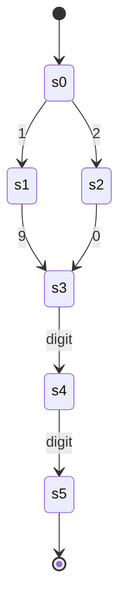

# ResumeLens — Formalization

Theoretical specification of the four formal models used by ResumeLens (deliverable:
*formal definitions of the models and their relation to the implementation*). Each section
states the mathematical object first and then maps it to the code that implements it.

| Section | Stage | Formal model | Status |
|---|---|---|---|
| 1 | Extraction | Regular expressions (regular languages) | this document |

Sections for the later stages are appended to this file by their own commits, each one
under its own top-level heading.

---

## 1. Stage 1: Regular Expressions & Lexical Extraction

Source of truth: `resumelens/extraction/patterns.py` (18 compiled patterns, registry
`PATTERNS`). Orchestration of the patterns lives in `resumelens/extraction/extractor.py`
and is not part of the formal model.

### 1.1 Conventions

- A *pattern* is a Python `re` expression written with the regular-expression constructs
  of formal language theory (concatenation, alternation, Kleene star and its derived
  forms) plus a small set of zero-width assertions (Section 1.5).
- $L(r)$ denotes the language of strings generated by the expression $r$.
- Derived operators are syntactic sugar over the three primitive operations:

$$
r^{+} = r\,r^{*}, \qquad r^{?} = r \mid \varepsilon, \qquad r^{\{m,n\}} = \bigcup_{k=m}^{n} r^{k}
$$

- A character class such as `[A-Za-z]` is the finite union of its symbols.
- Both an *inclusion* language $L(r)$ ("which strings are of the right shape") and a
  *match semantics* ("which substring is reported") are needed. Section 1.4 defines the
  former; Section 1.6 explains the latter.

### 1.2 Input alphabet $\Sigma$

Resumes are read by `core.reader.read_resume_file`, which decodes UTF-8, deletes the NUL
character and rewrites `\r\n` and `\r` as `\n`. The alphabet seen by Stage 1 is therefore

$$
\Sigma = \{\, c \in \text{Unicode scalar values} \;:\; c \neq \texttt{U+0000},\ c \neq \texttt{U+000D} \,\}
$$

$\Sigma$ is a **finite** set (at most $2^{20}+2^{16}$ symbols), so every classical result on
regular languages over finite alphabets applies. The ASCII range
$\Sigma_{\text{ASCII}} \subset \Sigma$ carries all the lexemes of the supported
technologies. The text is a word $w \in \Sigma^{*}$ in which `\n` is the only line
terminator.

The patterns use the following character classes (all are finite subsets of $\Sigma$):

| Symbol | Python | Set |
|---|---|---|
| $\mathbb{D}$ | `\d` | Unicode decimal digits (includes `0`–`9`) |
| $\mathbb{W}$ | `\w` | Unicode letters, digits and `_` |
| $\mathbb{A}$ | `[A-Za-z]` | ASCII letters only |
| $\mathbb{A}_{\#}$ | `[A-Za-z0-9]` | ASCII letters and digits |
| $S_h$ | `[ \t]` | horizontal whitespace: space and tab |
| $S$ | `[ .-]` | phone separators: space, dot, hyphen |

Note the asymmetry: `\d` and `\w` are Unicode-aware (the `re.ASCII` flag is not set),
while explicit classes such as `[A-Za-z]` are ASCII-only. This is the formal origin of
known limitation 1 (accented names are not matched by the name pattern, see 1.7).

### 1.3 Reusable lexical fragments

Fragments are plain strings composed by the compiled patterns. Let
$\mathbb{D}_{10} = \{0,\dots,9\}$.

$$
\begin{aligned}
\textsf{YEAR} &= (19 \mid 20)\,\mathbb{D}\,\mathbb{D} && L = \{1900,\dots,2099\},\ |L| = 200\\
\textsf{MONTH} &= \{\text{Jan}, \text{January}, \text{Feb}, \dots, \text{Dec}, \text{December}\} && \text{finite set of month names and abbreviations}\\
\textsf{DATE} &= \big(\textsf{MONTH}\ \texttt{.}^{?}\ S_h^{+}\big)^{?}\ \textsf{YEAR} && \text{e.g. } 2023,\ \text{Mar 2023}\\
\textsf{OPEN} &= \{\text{Present}, \text{Current}, \text{Now}, \text{Ongoing}\} && \text{open-ended period}\\
\textsf{SEP} &= S_h^{*}\,\big(\texttt{-} \mid \texttt{–} \mid \texttt{—} \mid \texttt{to}\big)\,S_h^{*} && \text{hyphen, en dash, em dash or the word } to\\
\textsf{RANGE} &= \textsf{DATE}\ \textsf{SEP}\ (\textsf{DATE} \mid \textsf{OPEN}) && \text{e.g. } 2019 - 2023,\ \text{Jan 2020 to Present}
\end{aligned}
$$

`YEAR` is a finite language, so it is regular. Its minimal DFA has six states plus an
implicit dead state:

Every transition not drawn leads to the (non-accepting) dead state. The automaton was
checked against `re.fullmatch(r"(?:19|20)\d{2}", w)` over all words of length 0–5 on the
alphabet `{0-9, a}`, with no disagreement.

### 1.4 Languages recognized by each pattern

Every pattern is a regular expression, hence $L(\text{pattern})$ is a regular language.
Languages with a finite number of strings are marked *finite*. In the formulas,
`\mathtt{x}` is the literal symbol `x` and juxtaposition is concatenation.

| Registry key | Pattern | Flags | Language |
|---|---|---|---|
| `email` | `EMAIL_PATTERN` | none | infinite |
| `phone` | `PHONE_PATTERN` | none | infinite |
| `url` | `URL_PATTERN` | IGNORECASE | infinite |
| `linkedin` | `LINKEDIN_URL_PATTERN` | IGNORECASE | infinite |
| `github` | `GITHUB_URL_PATTERN` | IGNORECASE | infinite |
| `section_header` | `SECTION_HEADER_PATTERN` | MULTILINE, IGNORECASE | finite core, anchored per line |
| `date_range` | `DATE_RANGE_PATTERN` | IGNORECASE | infinite |
| `degree` | `DEGREE_PATTERN` | none | infinite |
| `institution` | `INSTITUTION_PATTERN` | none | infinite |
| `education_entry` | `EDUCATION_ENTRY_PATTERN` | MULTILINE, IGNORECASE | infinite (spans two lines) |
| `programming_language` | `PROGRAMMING_LANGUAGE_PATTERN` | IGNORECASE | finite |
| `framework` | `FRAMEWORK_PATTERN` | IGNORECASE | finite |
| `ml_library` | `ML_LIBRARY_PATTERN` | IGNORECASE | finite |
| `database` | `DATABASE_PATTERN` | IGNORECASE | finite |
| `version_control` | `VERSION_CONTROL_PATTERN` | IGNORECASE | finite |
| `devops_cloud` | `DEVOPS_CLOUD_PATTERN` | IGNORECASE | finite |
| `years_experience` | `YEARS_EXPERIENCE_PATTERN` | IGNORECASE | infinite |
| `experience_entry` | `EXPERIENCE_ENTRY_PATTERN` | MULTILINE, IGNORECASE | infinite |

**Case-insensitive flag.** With `re.IGNORECASE`, the language of an expression $r$ is
$L_{i}(r) = L(r')$ where $r'$ replaces every literal letter $a$ by the class
$(a \mid A)$ (and, for Unicode, by its case-folding orbit). The result is again regular,
so the flag does not leave the class of regular languages.

#### 1.4.1 Contact

**Email.** Let $U = [\mathbb{A}_{\#}\ \texttt{.\_\%+-}]$ and
$L_{d} = [\mathbb{A}_{\#}\ \texttt{-}]$ (label symbols). Then

$$
L(\textsf{EMAIL}) = U^{+}\ \texttt{@}\ L_{d}^{+}\,\big(\texttt{.}\,L_{d}^{+}\big)^{*}\,\texttt{.}\,\mathbb{A}^{\{2,\}}
$$

The domain therefore has at least one dot and a top-level label of two or more letters.
Named groups: `user`, `domain`. Accepted: `wednesday.addams@nevermore.edu`. Rejected:
`user@localhost` (no dot), `a@b.c` (one-letter TLD).

**Phone.** With $S = \{\ ,\ \texttt{.},\ \texttt{-}\}$ (space included):

$$
L(\textsf{PHONE}) = \big(\texttt{+}\,\mathbb{D}^{\{1,3\}}\,S^{?}\big)^{?}\ \big(\texttt{(}\big)^{?}\,\mathbb{D}^{3}\,\big(\texttt{)}\big)^{?}\,S^{?}\ \mathbb{D}^{3}\,S^{?}\ \mathbb{D}^{4}
$$

Named groups: `country`, `area`, `prefix`, `line`. The shape is $3\text{-}3\text{-}4$
digits with an optional country prefix. Accepted: `+1 555 666 7777`, `(555) 123-4567`,
`5551234567`. Rejected: `2019 - 2023` (the first group of digits has length four, so no
$3\text{-}3\text{-}4$ factorization exists) and `5551234`.

Remark: the two parentheses are *independently* optional, so `(555 123 4567` also belongs
to the language. Enforcing that parentheses come in pairs is possible here only because
the nesting depth is bounded by one; unbounded balanced parentheses (the Dyck language)
would **not** be regular. The implemented language is a deliberate superset.

**URL.** With $\textsf{seg} = [\mathbb{W}\ \texttt{\%\~+-}]^{+}$ and
$\textsf{host} = L_{d}^{+}(\texttt{.}\,L_{d}^{+})^{+}$:

$$
L(\textsf{URL}) = (\texttt{http} \mid \texttt{https})\ \texttt{://}\ \textsf{host}\ \big(\texttt{/}\ \textsf{seg}\,(\texttt{.}\,\textsf{seg})^{*}\big)^{*}
$$

Named groups: `scheme`, `host`, `path`. A dot is only allowed *between* two segments, so a
sentence-ending period is never part of the match (`https://github.com/user.` reports
`https://github.com/user`). Rejected: `ftp://x.com`, `http://localhost` (host needs a dot).

**LinkedIn and GitHub.**

$$
\begin{aligned}
L(\textsf{LINKEDIN}) &= \texttt{http}\,\texttt{s}^{?}\ \texttt{://}\ (\texttt{www.})^{?}\,\texttt{linkedin.com}\ \texttt{/}\ (\texttt{in} \mid \texttt{company})\ \texttt{/}\ [\mathbb{W}\ \texttt{\%-}]^{+}\\
L(\textsf{GITHUB}) &= \texttt{http}\,\texttt{s}^{?}\ \texttt{://}\ (\texttt{www.})^{?}\,\texttt{github.com}\ \texttt{/}\ [\mathbb{W}\ \texttt{-}]^{+}\ \big(\texttt{/}\ [\mathbb{W}\ \texttt{-}]^{+}(\texttt{.}\,[\mathbb{W}\ \texttt{-}]^{+})^{*}\big)^{?}
\end{aligned}
$$

Both are specializations of the generic URL language: every handle, user or repository
segment is also a `seg`, and the fixed hosts have a dot, so
$L(\textsf{LINKEDIN}) \subseteq L(\textsf{URL})$ and
$L(\textsf{GITHUB}) \subseteq L(\textsf{URL})$ (the three patterns are all
case-insensitive). The inclusion is what lets the extractor use the generic pattern for
link collection and the specialized ones for classification of a link.

#### 1.4.2 Structure and education

**Section header.** Let $T$ be the finite set of titles
$\{\text{Contact}, \text{Summary}, \text{Technical Skills}, \text{Skills}, \text{Education}, \text{Experience}, \text{Work Experience}, \text{Projects}, \text{Certifications}\}$.
Per line:

$$
L(\textsf{SECTION\_HEADER}) = S_h^{*}\ T\ S_h^{*}\ \texttt{:}\ S_h^{*}
$$

with the anchors of Section 1.5 forcing the whole line to be of that shape. Named group:
`title`. Accepted: `Technical Skills:`. Rejected: `Technical Skills: Python` (text after
the colon) and `Technical  Skills:` (two spaces: the space inside a title is a literal
symbol, not a class).

**Date range.** $L(\textsf{DATE\_RANGE}) = L(\textsf{RANGE})$ with a word boundary on both
ends. Named groups: `start`, `end`. Accepted: `2019 - 2023`, `Jan 2020 to Present`,
`March 2021 – 2022`.

**Degree.** Let
$\textsf{LEVEL}$ be the finite set
$\{\text{Bachelor}, \text{Master}, \text{Associate}, \text{Doctorate}, \text{PhD}, \text{Ph.D}, \text{MBA}, \text{BSc}, \text{MSc}, \text{BS}, \text{B.S}, \text{MS}, \text{M.S}, \text{BA}, \text{B.A}, \text{MA}, \text{M.A}, \text{BEng}, \text{B.Eng}, \text{MEng}, \text{M.Eng}\}$
optionally followed by a period, and let
$\textsf{FIELD} = (\Sigma \setminus \{\texttt{\textbackslash n}, \texttt{,}, \texttt{;}, \texttt{(}\})^{*}\,(\Sigma \setminus (\{\texttt{,}, \texttt{;}, \texttt{(}\} \cup \text{whitespace}))$,
that is, a non-empty string without line breaks, commas, semicolons or `(`, whose last
symbol is not whitespace. Then

$$
L(\textsf{DEGREE}) = \textsf{LEVEL}\ \texttt{.}^{?}\ \big(S_h^{+}\,\texttt{of}\,S_h^{+}\,\mathbb{A}^{+}\big)^{?}\ S_h^{+}\ (\texttt{in} \mid \texttt{of})\ S_h^{+}\ \textsf{FIELD}
$$

Named groups: `degree`, `level`, `field`. This pattern is **case-sensitive** (no
`IGNORECASE`). Accepted: `B.S. in Computer Science`, `Master of Science in Data Science`.

**Institution.** Let $\textsf{Cap} = [A\text{-}Z]\,[\mathbb{W}\ \texttt{\&'-}]^{*}$ and
$K = \{\text{University}, \text{Institute}, \text{College}, \text{School}, \text{Academy}, \text{Polytechnic}, \text{Tech}\}$:

$$
\begin{aligned}
L(\textsf{INSTITUTION}) ={}& \texttt{University}\,S_h^{+}\,\texttt{of}\,S_h^{+}\,\textsf{Cap}\,(S_h^{+}\,\textsf{Cap})^{*}\\
\cup\ & \texttt{Universidad}\,S_h^{+}\,\big(\texttt{de}\,S_h^{+}\,(\texttt{la}\,S_h^{+})^{?}\big)^{?}\,\textsf{Cap}\\
\cup\ & (\textsf{Cap}\,S_h^{+})^{*}\ K
\end{aligned}
$$

Named group: `institution`. Case-sensitive. Accepted: `Nevermore University`,
`University of Michigan`, `Universidad de la Sabana`.

**Education entry** (two lines). With $\textsf{INST}' = (\Sigma \setminus \{\texttt{\textbackslash n}, \texttt{(}\})^{+}$:

$$
L(\textsf{EDUCATION\_ENTRY}) = S_h^{*}\ \textsf{DEGREE}\ S_h^{*}\ \texttt{\textbackslash n}\ S_h^{*}\ \textsf{INST}'\ S_h^{*}\ \texttt{(}\ \big(\textsf{RANGE} \mid \textsf{YEAR}\big)\ \texttt{)}
$$

Named groups: `degree`, `level`, `field`, `institution`, `start`, `end`, `graduation`.
It contains exactly one `\n`, so it is a regular language over several lines; a pattern
that must relate the two lines does not need a context-free model.

#### 1.4.3 Technical skills (finite languages)

The six skill patterns recognize **finite** sets of tokens, so they are the simplest
regular languages: finite unions of words. All of them name their group `skill`.

$$
\begin{aligned}
L_{\text{lang}} &= \{\text{Python}, \text{JavaScript}, \text{JS}, \text{TypeScript}, \text{TS}, \text{Java}, \text{C++}, \text{C\#}, \text{C}, \text{Go}, \text{Golang}, \text{Rust}, \text{Kotlin}, \text{Swift}, \text{PHP}, \text{Ruby}\}\\
L_{\text{fw}} &= \{\text{React}, \text{React.js}, \text{ReactJS}, \text{Angular}, \text{Angular.js}, \text{Vue}, \text{Vue.js}, \text{Node}, \text{Node.js}, \text{NodeJS}, \text{Django}, \text{Spring Boot}, \text{Express}, \text{Express.js}, \text{Next}, \text{Next.js}, \text{NextJS}, \text{Flask}, \text{FastAPI}, \text{Laravel}\}\\
L_{\text{ml}} &= \{\text{Pandas}, \text{NumPy}, \text{Scikit-learn}, \text{Scikit learn}, \text{sklearn}, \text{TensorFlow}, \text{Tensor Flow}, \text{PyTorch}, \text{Py Torch}\}\\
L_{\text{db}} &= \{\text{PostgreSQL}, \text{Postgres}, \text{MySQL}, \text{MariaDB}, \text{Oracle}, \text{SQLite}, \text{SQL Server}, \text{MongoDB}, \text{Mongo}, \text{Redis}, \text{Cassandra}\}\\
L_{\text{vcs}} &= \{\text{Git}, \text{GitHub}, \text{GitLab}, \text{Bitbucket}\}\\
L_{\text{cloud}} &= \{\text{Docker}, \text{Kubernetes}, \text{Terraform}, \text{Jenkins}, \text{Ansible}, \text{AWS}, \text{Amazon Web Services}, \text{Azure}, \text{Microsoft Azure}, \text{GCP}, \text{Google Cloud}, \text{Google Cloud Platform}\}
\end{aligned}
$$

Each set is taken up to letter case (`IGNORECASE`), so `js`, `Js` and `JS` are all in
$L_{\text{lang}}$. The words with a space (`Spring Boot`, `SQL Server`, ...) use the class
$S_h^{+}$, so any run of spaces or tabs is accepted. Consequently `SQL` alone is **not**
in $L_{\text{db}}$ (known limitation 4): it is only a prefix of a member.

The set of recognized skills is the union
$L_{\text{skills}} = L_{\text{lang}} \cup L_{\text{fw}} \cup L_{\text{ml}} \cup L_{\text{db}} \cup L_{\text{vcs}} \cup L_{\text{cloud}}$.
Regular languages are closed under union, so $L_{\text{skills}}$ is regular as well.

#### 1.4.4 Experience

**Declared years.**

$$
L(\textsf{YEARS}) = \mathbb{D}^{\{1,2\}}\,\texttt{+}^{?}\ S_h^{+}\ \texttt{year}\,\texttt{s}^{?}\ S_h^{+}\,\texttt{of}\,S_h^{+}\ \big(\texttt{professional}\,S_h^{+}\big)^{?}\ \texttt{experience}\ \Big(S_h^{+}\,(\Sigma \setminus \{\texttt{\textbackslash n}, \texttt{.}\})^{+}\Big)^{?}
$$

Named groups: `years`, `plus`, `activity`. Accepted:
`3 years of experience developing web applications` (group `activity` =
`developing web applications`, the final period is excluded because `.` is not allowed
inside the activity).

**Job entry.** With
$\textsf{ROLE} = \mathbb{A}\,(\Sigma \setminus \{\texttt{\textbackslash n}, \texttt{,}, \texttt{(}, \texttt{)}, \texttt{@}, \texttt{|}\})^{*}$ and
$\textsf{COMPANY} = (\Sigma \setminus \{\texttt{\textbackslash n}, \texttt{(}, \texttt{)}\})^{+}$:

$$
L(\textsf{EXPERIENCE\_ENTRY}) = S_h^{*}\ \textsf{ROLE}\ S_h^{*}\ (\texttt{,} \mid \texttt{at} \mid \texttt{@} \mid \texttt{|})\ S_h^{*}\ \textsf{COMPANY}\ S_h^{*}\ \texttt{(}\,\textsf{RANGE}\,\texttt{)}
$$

Named groups: `role`, `company`, `start`, `end`. The role must start with a letter, so a
bullet line such as `- Built a dashboard, Acme (2020 - 2021)` is not in the language.
Accepted: `Full Stack Developer, Raven Labs (2023 - 2026)`.

### 1.5 Lexical delimiters: formal justification

The patterns use three families of delimiters. This subsection shows that each one is
needed and that none of them takes the system out of the class of regular languages.

#### 1.5.1 Word boundaries (`\b`) and `(?<!\w)` / `(?!\w)`

Let $\chi : \Sigma \to \{0,1\}$ with $\chi(a) = 1$ iff $a \in \mathbb{W}$, extended with
$\chi(\#) = 0$ for the beginning and end of the text. A word boundary holds at position
$i$ of $w$ iff

$$
\chi(w_{i-1}) \neq \chi(w_i)
$$

The negative lookbehind `(?<!\w)` holds iff $\chi(w_{i-1}) = 0$ and the negative
lookahead `(?!\w)` holds iff $\chi(w_i) = 0$.

*Why they are needed.* A boundary turns "contains a word of $L$" into "contains $L$ as a
complete token". Without it the skill languages would match inside unrelated words: the
case-insensitive expression `Git` matches inside `Digit`, and `Go` would match inside
`Google`. With the delimiters the skill patterns report nothing for `Digit`, `Google`, `JSON`
or `Reactive`.

*Why `PROGRAMMING_LANGUAGE_PATTERN` uses lookarounds instead of `\b`.* Two members of
$L_{\text{lang}}$ (`C++`, `C#`) end in a symbol of $\Sigma \setminus \mathbb{W}$. For a
word that ends in a non-word symbol followed by a space, both sides have $\chi = 0$, so
`\b` is false: `re.search(r"\bC\+\+\b", "I know C++ well")` returns `None`, while the
lookaround form reports `C++`. The lookarounds only test that the *neighbour* is not a
word symbol, which is the intended condition for any member of the language. The extra
`C(?![+#])` makes the single letter `C` fail when it is the prefix of `C++` or `C#`.

*Regularity is preserved.* The boundary condition depends only on a window of two
symbols, that is, on the class $\chi$ of the previous symbol. A DFA for a pattern with
assertions is the product of (i) the DFA of the assertion-free core and (ii) a two-state
automaton that remembers $\chi$ of the last symbol read; the assertion is checked on the
transition that enters or leaves the match. Regular languages are closed under this
product construction, so $\mathtt{\backslash b}\,r\,\mathtt{\backslash b}$ with $r$ regular
is regular.

*Consequence.* The context test treats `.` as a non-word symbol, so in `Node.js` the
position before `js` has $\chi(\texttt{.}) = 0$: the token `js` passes the lookbehind and
is reported by `PROGRAMMING_LANGUAGE_PATTERN` (known limitation 2). It is a property of
the language definition, not a coding mistake, and is resolved in the normalization
stage rather than here.

#### 1.5.2 Multiline anchors (`^`, `$`)

With `re.MULTILINE`, `^` holds at position $i$ iff $i = 0$ or $w_{i-1} = \texttt{\textbackslash n}$, and `$` holds iff
$i = |w|$ or $w_i = \texttt{\textbackslash n}$. If $r$ is regular and does not contain `\n`, then

$$
\{\ u \in \text{Sub}(w) \;:\; u \text{ is matched by } \texttt{\^{}} r\, \texttt{\$} \ \} = \{\ \ell \in \text{Lines}(w) \;:\; \ell \in L(r)\ \}
$$

that is, an anchored pattern is a **line-level** filter: it recognizes whole lines of the
resume and never fragments of a line. This is exactly what `SECTION_HEADER_PATTERN`
needs: `Technical Skills:` is a header only if nothing else is on its line, so a
sentence such as `Experience: 3 years` is not a header. `EXPERIENCE_ENTRY_PATTERN` and
`EDUCATION_ENTRY_PATTERN` use only `^`, which pins the start of the record to the start
of a line while the end is delimited by the closing parenthesis.

The anchors depend on a single symbol of context ($w_{i-1}$ or $w_i$ equal to `\n`), so
the same product-automaton argument as in 1.5.1 shows that regularity is preserved. In
the implementation the assumption "the only line terminator is `\n`" is guaranteed by
the reader: on a text that still contains `\r`, the header
`Contact:\r\n` is **not** recognized (`[ \t]*$` cannot consume `\r`). This is why
normalizing line endings is part of ingestion and not of extraction.

#### 1.5.3 Named groups (`(?P<field>...)`)

A capturing group does not change the language: $L(\texttt{(?P<}n\texttt{>}\,r\,\texttt{)}) = L(r)$.
It adds a *labelling*: for a match $w = x\,u\,y$ where $u \in L(r)$, the group $n$
denotes the factor $u$ (its span $(i, j)$). Formally, each pattern with groups
$n_1,\dots,n_k$ defines a partial function

$$
\mu : L(\text{pattern}) \to (\Sigma^{*} \cup \{\bot\})^{k}
$$

where $\bot$ stands for a group that did not participate (for instance `country` in
`(555) 123-4567`). The consumer reads $\mu$ with `.groupdict()` instead of counting
parentheses, so the interface survives the rewriting of a sub-expression.

Two properties follow from the model. First, when $w$ can be split in several ways, the
choice of the factors is not given by the language but by the engine's disambiguation
policy (Section 1.6). Second, Python rejects a repeated group name inside one pattern,
which is why each fragment containing named groups, such as `_RANGE` (`start`/`end`),
is used **once** per compiled pattern.

### 1.6 Regular expressions and finite automata

#### 1.6.1 Equivalence (Kleene's theorem)

For a language $L \subseteq \Sigma^{*}$ the following statements are equivalent:

1. $L = L(r)$ for some regular expression $r$.
2. $L$ is accepted by a non-deterministic finite automaton (NFA, with or without
   $\varepsilon$-transitions).
3. $L$ is accepted by a deterministic finite automaton (DFA).

The equivalences are constructive:

- **Expression to $\varepsilon$-NFA (Thompson).** By induction on $r$: a symbol $a$ is a
  two-state automaton with one transition labelled $a$; $r_1 \mid r_2$ adds a new start
  state with $\varepsilon$-moves to both operands and a new accept state; $r_1 r_2$ links
  the accept state of $r_1$ to the start state of $r_2$ by an $\varepsilon$-move; $r^{*}$
  adds the back and skip $\varepsilon$-moves. The result has at most $2\,|r|$ states.
- **NFA to DFA (subset construction).** States of the DFA are sets of NFA states
  (after $\varepsilon$-closure); in the worst case there are $2^{n}$ of them. For a
  finite language such as $L_{\text{db}}$ the DFA is the trie of its words, with the
  case classes of `IGNORECASE` collapsing upper/lower-case edges.
- **DFA to expression.** State elimination, or solving the system of equations
  $X_q = \bigcup_a a\,X_{\delta(q,a)} \cup [q \in F]\,\varepsilon$ (Arden's lemma).

Hence every pattern of Section 1.4 has an equivalent NFA and DFA, and the closure
properties used in this document (union of skill languages, intersection with the
boundary-tracking automaton, concatenation of fragments) hold at the automaton level too.
The DFA of Section 1.3 is a concrete instance for `YEAR`.

#### 1.6.2 What Python's `re` actually does

The equivalence above is about the *language*. The `re` module (CPython's `sre`) compiles
a pattern to a bytecode program and executes it with a **backtracking** search over the
paths of the implicit NFA; it does not build the DFA. Three consequences matter for
ResumeLens:

1. **Match semantics is leftmost-first, not leftmost-longest.** For an alternation, the
   engine reports the first alternative (in source order) that lets the whole pattern
   succeed. The *language* is unaffected, but the *reported factor* depends on the order of
   the alternatives. This is why `JavaScript` is written before `Java` in
   `PROGRAMMING_LANGUAGE_PATTERN` and `PostgreSQL` before `Postgres` in
   `DATABASE_PATTERN`.
2. **Greedy and lazy quantifiers pick one factorization** among the several that
   the language allows. `EXPERIENCE_ENTRY_PATTERN` uses lazy quantifiers
   (`*?`, `+?`) so that the role and the company are the shortest strings that still
   reach the delimiter. Together with 1, this is the disambiguation policy that defines
   the function $\mu$ of Section 1.5.3.
3. **Cost.** A DFA decides membership in $O(n)$, whereas a backtracking engine can need
   more time. The patterns of ResumeLens use no backreferences and no nested unbounded
   quantifiers over overlapping character sets (the classical source of exponential
   behaviour), so they stay polynomial. However, two patterns contain adjacent
   quantifiers over overlapping sets (`EXPERIENCE_ENTRY_PATTERN`, with the role followed
   by `[ \t]*`, and `INSTITUTION_PATTERN`, with `(Cap [ \t]+)*` before the keyword) and
   have **quadratic** worst-case time: on adversarial lines of 2 000, 4 000 and 8 000
   characters we measured about 0.05 s, 0.2 s and 1.0 s. A real resume line is at most a
   few hundred characters, so this is irrelevant for the supported input, but it is a
   limit of the engine and not of the language.

Only constructs that preserve regularity are used: concatenation, alternation, bounded
and unbounded repetition, character classes, case folding, and the one-symbol context
assertions of 1.5. There are no backreferences (which would define non-regular
languages such as $\{ww\}$) and no recursion. Structures that need unbounded nesting, for
example a resume as a sequence of sections that contain entries, are not delimited by
Stage 1: the extractor cuts the text into sections with the line-level header pattern and
leaves the structural description to a later stage.

### 1.7 Known limitations seen as properties of the languages

| # | Observation | Formal reason |
|---|---|---|
| 1 | Names with accents (`Ana María Gómez`) are not recognized by the name line pattern. | The name uses the class $\mathbb{A}$ = `[A-Za-z]`, and `í`, `ó` are not in it; `\w` would include them. |
| 2 | `js` is reported inside `Node.js` / `React.js`. | The lookbehind only tests $\chi(\texttt{.}) = 0$ (Section 1.5.1), so `js` is a complete token between a `.` and the end of the word. |
| 3 | `Python and Git.` is returned as one token. | Skill splitting uses the separator language $\{\texttt{,}, \texttt{;}, \texttt{\textbackslash n}\}$; the word `and` is not a separator. |
| 4 | `SQL` alone is not recognized as a database. | `SQL` is not a member of $L_{\text{db}}$; only `SQL Server` is (Section 1.4.3). |
| 5 | Education and institution keywords are English-only (plus `Universidad`). | $L(\textsf{DEGREE})$ and $L(\textsf{INSTITUTION})$ are finite unions of English keywords. |
| 6 | A line with the wrong role is still accepted as a job entry. | $\textsf{ROLE}$ is any string starting with a letter; there is no finite list of titles. |

Limitations 1 and 2 are covered by non-strict `xfail` tests in `tests/test_extraction.py`
as executable evidence.
