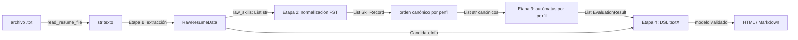

# ResumeLens — Diseño de Módulos

Documento de diseño de software (entregable 2a: *Design of modules — functions, inputs-outputs*).
Describe la arquitectura, el flujo de datos entre las cuatro etapas formales y los contratos
de entrada/salida de cada módulo. Los módulos marcados **[planeado]** se implementan en commits
posteriores; los marcados **[existente]** ya están en el repositorio.

## 1. Alcance y principios

- ResumeLens **no rankea candidatos ni toma decisiones de contratación**: solo evalúa si las
  calificaciones *explícitamente* identificadas satisfacen patrones formales de un perfil.
- Los cuatro perfiles (Full Stack Developer, Machine Learning Engineer, DevOps Engineer,
  Data Engineer) se procesan con **la misma solución general**; solo cambian los *datos*
  (tablas de transductores, orden canónico, autómata).
- Cada etapa se apoya en un modelo formal visto en el curso:

| Etapa | Modelo formal | Herramienta | Paquete |
|---|---|---|---|
| 1. Extracción | Expresiones regulares | `re` | `resumelens/extraction` |
| 2. Normalización | Transductores de estados finitos (7-tupla) | `pyformlang.fst.FST` | `resumelens/normalization` |
| 3. Clasificación | Autómatas finitos (5-tupla) | `pyformlang.finite_automaton` | `resumelens/classification` |
| 4. DSL | Gramática libre de contexto (EBNF) | `textX` | `resumelens/grammar`, `resumelens/visualization` |

## 2. Estructura del repositorio

```
ResumeLens/
├── data/input_resumes/        # CVs sintéticos (fullstack, ml, devops, data, invalid)
├── docs/                      # documentos de diseño (Markdown)
├── resumelens/
│   ├── core/                  # modelos de dominio e ingesta         [existente]
│   │   ├── models.py
│   │   └── reader.py
│   ├── extraction/            # Etapa 1 (regex)                      [planeado]
│   ├── normalization/         # Etapa 2 (FST)                        [planeado]
│   ├── classification/        # Etapa 3 (autómatas)                  [planeado]
│   ├── grammar/               # Etapa 4 (gramática textX, .tx)       [planeado]
│   └── visualization/         # salida HTML/Markdown                 [planeado]
└── tests/                     # pytest (conftest.py con fixtures)
```

## 3. Flujo de datos



Resumen por etapa:

1. **Extracción** — del texto crudo obtiene datos de contacto, educación, experiencia y
   *cadenas de habilidades* tal como las escribió el candidato (`JS`, `React.js`, `Postgres`…).
   No decide equivalencias ni perfiles.
2. **Normalización** — cada cadena cruda pasa por un FST que produce su forma canónica
   (`JS → JAVASCRIPT`, `NodeJS → NODE_JS`). Luego se ordena según la categoría definida por el perfil
   (p. ej. Full Stack: Frontend → Backend → Database → Version control), de modo que el resultado
   no dependa del orden en que el candidato escribió el CV.
3. **Clasificación** — por cada perfil, un autómata finito acepta o rechaza la secuencia
   canónica ordenada. Salida: un `EvaluationResult` por perfil.
4. **DSL** — la información estructurada se serializa al lenguaje de especificación de candidato,
   se valida con la gramática textX (rechazando violaciones léxicas o sintácticas) y se genera la
   visualización.

## 4. Modelos de dominio [existente] — `resumelens/core/models.py`

| Clase | Campos | Uso |
|---|---|---|
| `CandidateInfo` | `name: str`, `email: str`, `phone: str`, `links: List[str]`, `education: List[str]`, `experience: List[str]` | Datos personales extraídos (Etapa 1) |
| `RawResumeData` | `raw_text: str`, `candidate_info: CandidateInfo`, `raw_skills: List[str]` | Salida de la Etapa 1 |
| `SkillRecord` | `raw_name: str`, `canonical_name: str`, `category: str` | Salida de la Etapa 2 |
| `EvaluationResult` | `profile_name: str`, `is_accepted: bool`, `matched_sequence: List[str]`, `details: str` | Salida de la Etapa 3 |

Categorías (`SkillRecord.category`): `frontend`, `backend`, `database`, `vcs`, `ml`, `cloud`, y las
que requieran los perfiles DevOps y Data.

## 5. Contratos de funciones por módulo

Convenciones: las funciones son **puras** (sin estado global ni efectos secundarios) salvo
`read_resume_file` y la escritura de visualizaciones; los errores se señalan con excepciones
tipadas, nunca con valores centinela.

### 5.1 Ingesta — `resumelens/core/reader.py` [existente]

| Función | Entrada | Salida | Errores |
|---|---|---|---|
| `read_resume_file(file_path)` | `str \| Path` | `str`: texto UTF‑8, sin `\x00`, saltos de línea `\n` | `FileNotFoundError` si no existe el archivo |

### 5.2 Etapa 1 — `resumelens/extraction/` [planeado]

Patrones compilados con `re.compile`; uso de `search`, `findall`, `finditer`, `split`, `sub`,
grupos nombrados `(?P<nombre>...)` y `re.MULTILINE`.

| Función | Entrada | Salida | Descripción |
|---|---|---|---|
| `extract_contact(text)` | `str` | `dict[str, str \| list[str]]` con `email`, `phone`, `links` | Correo, teléfono, URLs (LinkedIn/GitHub) |
| `extract_name(text)` | `str` | `str` (vacío si no hay) | Nombre del candidato (primera línea con formato de nombre) |
| `extract_education(text)` | `str` | `List[str]` | Líneas de la sección *Education* |
| `extract_experience(text)` | `str` | `List[str]` | Años de experiencia y cargos |
| `extract_skills(text)` | `str` | `List[str]` | Cadenas crudas de la sección *Technical Skills*, en orden de aparición y sin normalizar |
| `extract_resume(text)` | `str` | `RawResumeData` | Orquesta las anteriores; `raw_text` conserva el original |

Contrato: sobre un CV sin sección de habilidades (`resume_invalid.txt`) retorna `raw_skills == []`
sin lanzar excepción.

### 5.3 Etapa 2 — `resumelens/normalization/` [planeado]

Cada transductor se define como M = (Q, Σ, Γ, δ, ω, q₀, F) con `pyformlang.fst.FST`.

| Función | Entrada | Salida | Descripción |
|---|---|---|---|
| `build_skill_transducer()` | — | `FST` | Construye el FST con `add_transitions` |
| `normalize_skill(raw)` | `str` | `str \| None` | Traduce con `list(fst.translate(...))`; `None` si no hay traducción |
| `normalize_skills(raw_skills)` | `List[str]` | `List[SkillRecord]` | Normaliza y asigna categoría; elimina duplicados canónicos |
| `sort_by_profile(records, profile)` | `List[SkillRecord]`, `str` | `List[str]` | Secuencia canónica ordenada por el orden de categorías del perfil |

Ejemplo: `["Git", "NodeJS", "JS", "Postgres", "React.js"]` con perfil Full Stack →
`["JAVASCRIPT", "REACT", "NODE_JS", "POSTGRESQL", "GIT"]`.

### 5.4 Etapa 3 — `resumelens/classification/` [planeado]

Cada autómata se define como M = (Q, Σ, δ, q₀, F) con `pyformlang.finite_automaton`
(`DeterministicFiniteAutomaton`, `NondeterministicFiniteAutomaton` o `EpsilonNFA`).

| Función | Entrada | Salida | Descripción |
|---|---|---|---|
| `build_profile_automaton(profile)` | `str` | autómata | Autómata del perfil (4 perfiles soportados) |
| `evaluate_profile(sequence, profile)` | `List[str]`, `str` | `EvaluationResult` | Usa `automaton.accepts(sequence)` |
| `classify_resume(sequence)` | `List[str]` | `List[EvaluationResult]` | Evalúa los 4 perfiles |

Perfiles: `FULL_STACK_DEVELOPER`, `MACHINE_LEARNING_ENGINEER`, `DEVOPS_ENGINEER`, `DATA_ENGINEER`.
Un CV puede ser aceptado por 0, 1 o varios perfiles.

### 5.5 Etapa 4 — `resumelens/grammar/` y `resumelens/visualization/` [planeado]

| Función | Entrada | Salida | Errores |
|---|---|---|---|
| `build_profile_source(info, records, results)` | `CandidateInfo`, `List[SkillRecord]`, `List[EvaluationResult]` | `str` en el DSL | — |
| `load_metamodel()` | — | metamodelo (`metamodel_from_file`) | — |
| `parse_candidate_profile(source)` | `str` | modelo textX validado | `TextXSyntaxError` ante violaciones |
| `render_html(model)` / `render_markdown(model)` | modelo validado | `str` | — |
| `write_visualization(content, path)` | `str`, `Path` | `Path` | `OSError` |

La gramática (`.tx`) se documenta en EBNF con terminales y no terminales explícitos, y admite
elementos repetidos (varias experiencias, estudios y habilidades).

### 5.6 Orquestación [planeado]

| Función | Entrada | Salida |
|---|---|---|
| `run_pipeline(file_path)` | `str \| Path` | `PipelineReport` (candidato, habilidades normalizadas, resultados por perfil, DSL, ruta de visualización) |

## 6. Formalización (referencia)

- **Etapa 1:** por cada tipo de dato se documenta la regex y el lenguaje que reconoce.
- **Etapa 2:** M = (Q, Σ, Γ, δ, ω, q₀, F), con diagrama del transductor.
- **Etapa 3:** M = (Q, Σ, δ, q₀, F), indicando si es DFA, NFA o ε‑NFA, con diagrama de transiciones.
- **Etapa 4:** G = (V, Σ, S, P) en EBNF.

El detalle de cada formalización se entrega en documentos separados dentro de `docs/`.

## 7. Diseño de pruebas

### 7.1 Fixtures (`tests/conftest.py`)

| Fixture | Alcance | Contenido |
|---|---|---|
| `resumes_dir` | sesión | `Path` a `data/input_resumes/` |
| `resume_paths` | sesión | alias → `Path` (`fullstack`, `ml`, `devops`, `data`, `invalid`) |
| `resume_texts` | sesión | alias → texto cargado en memoria con `read_resume_file` |
| `valid_resume_texts` | sesión | solo los 4 CVs bien formados |
| `fullstack_text`, `ml_text`, `devops_text`, `data_text`, `invalid_text` | función | texto de cada CV |
| `raw_resume_factory` | función | `alias → RawResumeData(raw_text=...)` |

### 7.2 Escenarios

| Escenario | CV | Resultado esperado |
|---|---|---|
| Full Stack válido | `resume_fullstack` | Habilidades `JS, React.js, NodeJS, Postgres, Git`; Full Stack aceptado |
| ML válido | `resume_ml` | `Python, Pandas, NumPy, Scikit-learn, TensorFlow, SQL, Git`; ML aceptado |
| DevOps válido | `resume_devops` | DevOps aceptado |
| Data válido | `resume_data` | Data Engineer aceptado |
| CV inválido | `resume_invalid` | Sin sección de habilidades; ningún perfil aceptado; el DSL rechaza representaciones incompletas |
| Orden de escritura | cualquiera | La secuencia ordenada no depende del orden original |
| Archivo inexistente | — | `FileNotFoundError` |

### 7.3 Pruebas actuales (`tests/test_reader.py`)

Verifican que `read_resume_file` lee los cinco CVs sintéticos sin errores, normaliza `\r\n`/`\r`
y nulos, acepta `str` o `Path`, lanza `FileNotFoundError` si falta el archivo, y que los modelos
de dominio se instancian con listas independientes por instancia.

## 8. Restricciones

Solo se usan `re`, `pyformlang` y `textX`. No se usan librerías de NLP/ML, otros generadores de
parsers, librerías de grafos, bases de datos ni servicios web.
