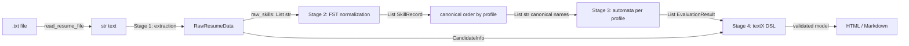

# ResumeLens — Module Design

Software design document (deliverable 2a: *Design of modules — functions, inputs-outputs*).
It describes the architecture, the data flow between the four formal stages and the
input/output contracts of each module. Modules marked **[planned]** are implemented in later
commits; those marked **[implemented]** are already in the repository.

## 1. Scope and principles

- ResumeLens **does not rank candidates or make hiring decisions**: it only evaluates whether
  the qualifications *explicitly* identified in a resume satisfy the formal patterns of a profile.
- The four profiles (Full Stack Developer, Machine Learning Engineer, DevOps Engineer,
  Data Engineer) are processed by **the same general solution**; only the *data* changes
  (transducer tables, canonical order, automaton).
- Each stage relies on a formal model seen in the course:

| Stage | Formal model | Tool | Package |
|---|---|---|---|
| 1. Extraction | Regular expressions | `re` | `resumelens/extraction` |
| 2. Normalization | Finite-state transducers (7-tuple) | `pyformlang.fst.FST` | `resumelens/normalization` |
| 3. Classification | Finite automata (5-tuple) | `pyformlang.finite_automaton` | `resumelens/classification` |
| 4. DSL | Context-free grammar (EBNF) | `textX` | `resumelens/grammar`, `resumelens/visualization` |

## 2. Repository structure

```
ResumeLens/
├── data/input_resumes/        # synthetic resumes (fullstack, ml, devops, data, invalid)
├── docs/                      # design documents (Markdown)
├── resumelens/
│   ├── core/                  # domain models and ingestion           [implemented]
│   │   ├── models.py
│   │   └── reader.py
│   ├── extraction/            # Stage 1 (regex)                       [implemented]
│   │   ├── patterns.py
│   │   └── extractor.py
│   ├── normalization/         # Stage 2 (FST + canonical ordering)    [implemented]
│   │   ├── transducers.py
│   │   ├── normalizer.py
│   │   └── sorter.py
│   ├── classification/        # Stage 3 (automata)                    [planned]
│   ├── grammar/               # Stage 4 (textX grammar, .tx)          [planned]
│   └── visualization/         # HTML/Markdown output                 [planned]
└── tests/                     # pytest (conftest.py with fixtures)
```

## 3. Data flow



Summary by stage:

1. **Extraction** — from the raw text it obtains the name, contact data, education, experience,
   the *skill strings* of the *Technical Skills* section exactly as the candidate wrote them
   (`JS`, `React.js`, `Postgres`…) and the technologies that the regex bank detects in the whole
   resume, grouped by type. It does not decide equivalences or profiles.
2. **Normalization** — each raw string goes through the composition of two FSTs: one that lowers
   the token to lower case character by character, and one per technology family that translates
   the whole word to its canonical form (`JS → js → JAVASCRIPT`, `NodeJS → nodejs → NODE_JS`).
   The result is then sorted by the slots (categories) of the profile (e.g. Full Stack: Frontend →
   Backend → Database → Version control), so that it does not depend on the order in which the
   candidate wrote the resume.
3. **Classification** — for each profile, a finite automaton accepts or rejects the sorted
   canonical sequence. Output: one `EvaluationResult` per profile.
4. **DSL** — the structured information is serialized to the candidate specification language,
   validated with the textX grammar (rejecting lexical or syntactic violations) and the
   visualization is generated.

## 4. Domain models [implemented] — `resumelens/core/models.py`

| Class | Fields | Use |
|---|---|---|
| `CandidateInfo` | `name: str`, `email: str`, `phone: str`, `links: List[str]`, `education: List[str]`, `experience: List[str]` | Extracted personal data (Stage 1) |
| `RawResumeData` | `raw_text: str`, `candidate_info: CandidateInfo`, `raw_skills: List[str]`, `detected_skills: Dict[str, List[str]]` | Output of Stage 1 |
| `SkillRecord` | `raw_name: str`, `canonical_name: str`, `category: str` | Output of Stage 2 |
| `EvaluationResult` | `profile_name: str`, `is_accepted: bool`, `matched_sequence: List[str]`, `details: str` | Output of Stage 3 |

Categories (`SkillRecord.category`, `CATEGORY_*` constants of `normalizer.py`). Each one
corresponds to a bullet of the qualification list of a profile in the assignment:

| Category | Canonical names | Assignment bullet / profile |
|---|---|---|
| `web_language` | `JAVASCRIPT`, `TYPESCRIPT` | "JavaScript or TypeScript" (Full Stack) |
| `frontend` | `REACT`, `ANGULAR`, `VUE` | "React, Angular, or Vue" (Full Stack) |
| `backend` | `NODE_JS`, `DJANGO`, `SPRING_BOOT` | "Node.js, Django, Spring Boot" (Full Stack) |
| `api` | `REST_API` | "REST APIs" (Full Stack) |
| `database` | `SQL`, `NOSQL`, `POSTGRESQL`, `MYSQL`, `MONGODB`, … | "SQL or NoSQL databases" (Full Stack), "SQL" (ML) |
| `vcs` | `GIT` | "Git" (all) |
| `language` | `PYTHON`, `JAVA`, `GO`, `C_PLUS_PLUS`, … | "Python" (ML) |
| `data_library` | `PANDAS`, `NUMPY`, `MATPLOTLIB` | "Pandas or NumPy" (ML) |
| `ml_framework` | `SCIKIT_LEARN`, `TENSORFLOW`, `PYTORCH`, `KERAS` | "Scikit-learn", "TensorFlow, or PyTorch" (ML) |
| `ml_practice` | `ML_MODEL_DEVELOPMENT` | "Machine-learning model development" (ML) |
| `container`, `orchestration`, `iac`, `ci_cd`, `cloud` | `DOCKER`; `KUBERNETES`; `TERRAFORM`, `ANSIBLE`; `JENKINS`; `AWS`, `AZURE`, `GCP` | DevOps Engineer (team profile) |
| `data_processing`, `workflow` | `SPARK`; `AIRFLOW` | Data Engineer (team profile) |

## 5. Function contracts by module

Conventions: functions are **pure** (no global state or side effects) except
`read_resume_file` and the writing of visualizations; errors are signaled with typed
exceptions, never with sentinel values.

### 5.1 Ingestion — `resumelens/core/reader.py` [implemented]

| Function | Input | Output | Errors |
|---|---|---|---|
| `read_resume_file(file_path)` | `str \| Path` | `str`: UTF‑8 text, without `\x00`, `\n` line breaks | `FileNotFoundError` if the file does not exist |

### 5.2 Stage 1 — `resumelens/extraction/` [implemented]

Patterns compiled with `re.compile` in `patterns.py` (registry `PATTERNS`, skill bank
`SKILL_PATTERNS`); use of `match`, `search`, `finditer`, `split` and `sub`, named groups
`(?P<name>...)`, `re.MULTILINE` and `re.IGNORECASE`. The formalization of each pattern is in
`docs/formalization.md`, Section 1.

| Function | Input | Output | Patterns used |
|---|---|---|---|
| `split_sections(text)` | `str` | `Dict[str, str]` (lower-case title → body; `""` = preamble) | `SECTION_HEADER_PATTERN` |
| `extract_name(text)` | `str` | `str` (empty if none) | `NAME_PATTERN` on the first line |
| `extract_contact(text)` | `str` | `Dict[str, object]` with `email`, `phone`, `links`, `linkedin`, `github` | `EMAIL_`, `PHONE_`, `URL_`, `LINKEDIN_URL_`, `GITHUB_URL_PATTERN` |
| `extract_education(text)` | `str` | `List[str]`: lines of *Education* with a degree, institution or period | `DEGREE_`, `INSTITUTION_`, `DATE_RANGE_PATTERN` |
| `extract_experience(text)` | `str` | `List[str]`: years of experience and job entries | `YEARS_EXPERIENCE_`, `EXPERIENCE_ENTRY_PATTERN` |
| `extract_skills(text)` | `str` | `List[str]`: raw strings of *Technical Skills*, in order and not normalized | `SKILL_SEPARATOR_PATTERN` |
| `extract_technologies(text)` | `str` | `Dict[str, List[str]]`: type → detected spellings, without repetitions | `SKILL_PATTERNS` (whole resume except *Contact* and URLs) |
| `extract_resume(text)` | `str` | `RawResumeData` | Orchestrates the previous ones; `raw_text` keeps the original |

Contract: on a resume without a skills section (`resume_invalid.txt`) it returns
`raw_skills == []` without raising an exception.

### 5.3 Stage 2 — `resumelens/normalization/` [implemented]

Each transducer is defined as M = (Q, Σ, Γ, δ, ω, q₀, F) with `pyformlang.fst.FST`, built
with `add_transitions`, `add_start_state` and `add_final_state` and evaluated with `translate`,
as in class. The normalization of a token is the composition of two transducers:

1. **T_case** (`build_case_folding_transducer`): a single state `q0`, initial and accepting,
   with one loop `c:lower(c)` for each character of the alphabet `INPUT_ALPHABET`. It reads the
   token character by character and rejects characters outside the alphabet.
2. **T_family** (`build_transducer(variants)`): *whole-word* input symbols (like
   `translate(['llor', 'ar'])` in the slides). Q = {q0} ∪ {f_C}, one transition
   `variant:CANONICAL` from `q0` to `f_C` for each spelling. There are 7 families in
   `FAMILY_VARIANTS`: web, ai, database, devops, vcs, language and data.

**`transducers.py`**

| Function | Input | Output | Description |
|---|---|---|---|
| `build_case_folding_transducer(alphabet)` | `Iterable[str]` (default `INPUT_ALPHABET`) | `FST` | T_case |
| `fold_case(token)` | `str` | `str \| None` | Applies T_case; `None` if the token is empty or has characters outside Σ |
| `build_transducer(variants)` | `Mapping[str, Iterable[str]]` | `FST` | T_family; `ValueError` if a spelling maps to two canonical names |
| `apply_transducer(fst, token)` | `FST`, `str` | `str \| None` | T_case and then `fst.translate([lower_case_token])`; `ValueError` if ambiguous |
| `build_<family>_transducer()` / `get_<family>_transducer()` | — | `FST` | Builds / returns the cached FST of each family |
| `normalize_<family>_skill(token)` | `str` | `str \| None` | Translates with a single family |

**`normalizer.py`**

| Function | Input | Output | Description |
|---|---|---|---|
| `normalize_skill(raw)` | `str` | `str \| None` | Tries the families in order; collapses inner whitespace |
| `normalize_skills(raw_skills)` | `List[str]` | `List[SkillRecord]` | Normalizes, assigns a category and removes duplicate canonical names |
| `normalize_with_report(raw_skills)` | `List[str]` | `NormalizationResult` | Also reports `unrecognized` and `duplicates` |

**`sorter.py`**

| Function | Input | Output | Description |
|---|---|---|---|
| `resolve_profile(profile)` | `str` | `str` (`FULL_STACK_DEVELOPER`, …) | Accepts `"Full Stack Developer"`; `UnknownProfileError` if it does not exist |
| `profile_slots(profile)` | `str` | `Tuple[str, ...]` | Slots (categories) of the profile, in order (`PROFILE_SLOTS`) |
| `sort_records_by_profile(records, profile)` | `List[SkillRecord]`, `str` | `List[SkillRecord]` | Canonical permutation of the records |
| `sort_by_profile(records, profile)` | `List[SkillRecord]`, `str` | `List[str]` | Canonical names in canonical order |

Slots by profile (`PROFILE_SLOTS`):

| Profile | Slots |
|---|---|
| `FULL_STACK_DEVELOPER` | `web_language` → `frontend` → `backend` → `database` → `api` → `vcs` |
| `MACHINE_LEARNING_ENGINEER` | `language` → `data_library` → `ml_framework` → `ml_practice` → `database` → `vcs` |
| `DEVOPS_ENGINEER` | `language` → `container` → `orchestration` → `iac` → `ci_cd` → `cloud` → `vcs` |
| `DATA_ENGINEER` | `language` → `data_processing` → `workflow` → `database` → `cloud` → `vcs` |

Ordering rule (total; it depends only on the *set* of skills):

1. **Profile part:** the skills whose category is a slot of the profile, slot by slot; inside a
   slot, in lexicographic order of the canonical name.
2. **Rest:** the skills of other categories (noise for that profile), in lexicographic order of
   `(category, canonical name)`.

Examples from the assignment:

- Full Stack: `["Git", "NodeJS", "JS", "Postgres", "React.js"]` →
  `["JAVASCRIPT", "REACT", "NODE_JS", "POSTGRESQL", "GIT"]`.
- ML: `PYTHON, PANDAS, TENSORFLOW, POSTGRESQL, GIT` keeps that order.
- ML (Mary Jane Watson): `Python, Pandas, NumPy, Scikit-learn, TensorFlow, SQL, Git` →
  `PYTHON, NUMPY, PANDAS, SCIKIT_LEARN, TENSORFLOW, SQL, GIT`.

**Contract of the sorter output that Stage 3 must respect.** A slot may hold zero, one or
several skills (Mary Jane has `NUMPY` and `PANDAS` in `data_library`), and noise may follow the
profile part. The diagram of the assignment reads one symbol per slot
(`q0 –PYTHON→ q1 –PANDAS|NUMPY→ q2 …`). Therefore each automaton must accept **one or more**
skills per mandatory slot, allow optional slots to be missing and tolerate trailing noise.
Otherwise the reference ML resume would be rejected.

### 5.4 Stage 3 — `resumelens/classification/` [planned]

Each automaton is defined as M = (Q, Σ, δ, q₀, F) with `pyformlang.finite_automaton`
(`DeterministicFiniteAutomaton`, `NondeterministicFiniteAutomaton` or `EpsilonNFA`).

| Function | Input | Output | Description |
|---|---|---|---|
| `build_profile_automaton(profile)` | `str` | automaton | Automaton of the profile (4 supported profiles) |
| `evaluate_profile(sequence, profile)` | `List[str]`, `str` | `EvaluationResult` | Uses `automaton.accepts(sequence)` |
| `classify_resume(sequence)` | `List[str]` | `List[EvaluationResult]` | Evaluates the 4 profiles |

Profiles: `FULL_STACK_DEVELOPER`, `MACHINE_LEARNING_ENGINEER`, `DEVOPS_ENGINEER`, `DATA_ENGINEER`.
A resume may be accepted by 0, 1 or several profiles.

### 5.5 Stage 4 — `resumelens/grammar/` and `resumelens/visualization/` [planned]

| Function | Input | Output | Errors |
|---|---|---|---|
| `build_profile_source(info, records, results)` | `CandidateInfo`, `List[SkillRecord]`, `List[EvaluationResult]` | `str` in the DSL | — |
| `load_metamodel()` | — | metamodel (`metamodel_from_file`) | — |
| `parse_candidate_profile(source)` | `str` | validated textX model | `TextXSyntaxError` on violations |
| `render_html(model)` / `render_markdown(model)` | validated model | `str` | — |
| `write_visualization(content, path)` | `str`, `Path` | `Path` | `OSError` |

The grammar (`.tx`) is documented in EBNF with explicit terminals and non-terminals, and it
supports repeated elements (several experiences, studies and skills).

### 5.6 Orchestration [planned]

| Function | Input | Output |
|---|---|---|
| `run_pipeline(file_path)` | `str \| Path` | `PipelineReport` (candidate, normalized skills, results per profile, DSL, visualization path) |

## 6. Formalization (reference)

- **Stage 1:** for each data type, the regex and the language it recognizes are documented.
- **Stage 2:** M = (Q, Σ, Γ, δ, ω, q₀, F), with a transducer diagram.
- **Stage 3:** M = (Q, Σ, δ, q₀, F), stating whether it is a DFA, NFA or ε‑NFA, with a transition diagram.
- **Stage 4:** G = (V, Σ, S, P) in EBNF.

The details are delivered in `docs/formalization.md`, one section per stage (Section 1,
regular expressions, is already written).

## 7. Test design

### 7.1 Fixtures (`tests/conftest.py`)

| Fixture | Scope | Content |
|---|---|---|
| `resumes_dir` | session | `Path` to `data/input_resumes/` |
| `resume_paths` | session | alias → `Path` (`fullstack`, `ml`, `devops`, `data`, `invalid`) |
| `resume_texts` | session | alias → text loaded in memory with `read_resume_file` |
| `valid_resume_texts` | session | only the 4 well-formed resumes |
| `fullstack_text`, `ml_text`, `devops_text`, `data_text`, `invalid_text` | function | text of each resume |
| `raw_resume_factory` | function | `alias → RawResumeData(raw_text=...)` |

### 7.2 Scenarios

| Scenario | Resume | Expected result |
|---|---|---|
| Valid Full Stack | `resume_fullstack` | Skills `JS, React.js, NodeJS, Postgres, Git`; Full Stack accepted |
| Valid ML | `resume_ml` | `Python, Pandas, NumPy, Scikit-learn, TensorFlow, SQL, Git`; ML accepted |
| Valid DevOps | `resume_devops` | DevOps accepted |
| Valid Data | `resume_data` | Data Engineer accepted |
| Invalid resume | `resume_invalid` | No skills section; no profile accepted; the DSL rejects incomplete representations |
| Writing order | any | The sorted sequence does not depend on the original order |
| Missing file | — | `FileNotFoundError` |

### 7.3 Current tests

| File | What it verifies |
|---|---|
| `tests/test_reader.py` | `read_resume_file` reads the five resumes, normalizes `\r\n`/`\r` and NULs, accepts `str` or `Path` and raises `FileNotFoundError`; the models are instantiated with independent lists |
| `tests/test_patterns.py` | Each pattern of `patterns.py` with strings in and out of its language, over the resumes and the invalid resume |
| `tests/test_extraction.py` | Extractor functions, token isolation, `extract_technologies` and full extraction of the resumes |
| `tests/test_normalization.py` | 7-tuple of T_case and of the 7 families, translations, rejections, categories, duplicates and the pipeline with Stage 1 |

## 8. Constraints

Only `re`, `pyformlang` and `textX` are used. No NLP/ML libraries, other parser generators,
graph libraries, databases or web services are used.
